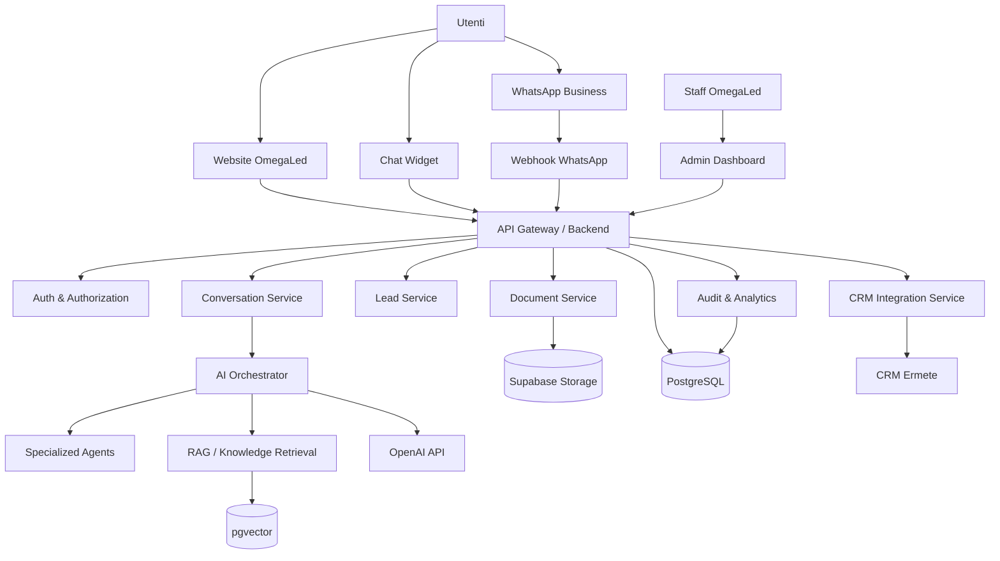
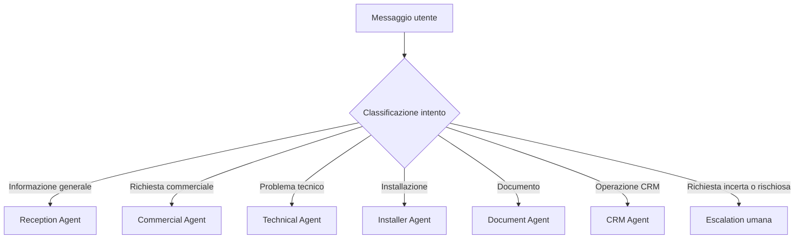
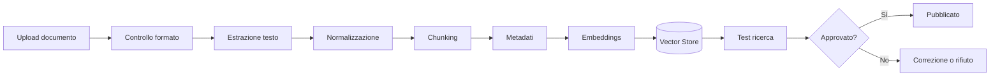
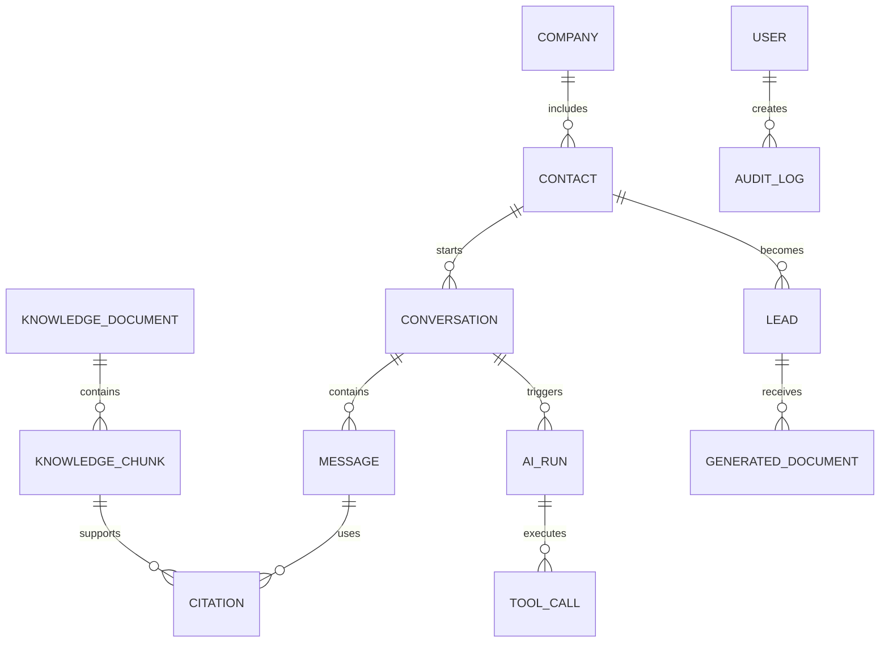
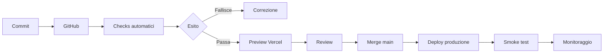

# OmegaLed AI Platform
## System Architecture Specification

> Questo documento definisce l'architettura tecnica di riferimento della OmegaLed AI Platform. Ogni implementazione futura deve rispettare queste decisioni oppure introdurre una modifica tramite Architecture Decision Record approvato.

---

## 1. Scopo del documento

La OmegaLed AI Platform non deve essere sviluppata come un chatbot isolato, ma come una piattaforma aziendale modulare, sicura e progressivamente estendibile.

La piattaforma dovrà supportare:

- assistenza commerciale;
- assistenza tecnica;
- consultazione della knowledge base;
- generazione di documenti;
- gestione delle conversazioni;
- raccolta e qualificazione dei lead;
- integrazione con il CRM Ermete;
- integrazione con WhatsApp Business;
- dashboard amministrativa;
- area rivenditori;
- area installatori;
- agenti AI specializzati;
- analytics operativi e commerciali;
- tracciabilità delle risposte;
- controllo dei costi AI;
- escalation verso operatori umani.

Il presente documento descrive:

1. architettura logica;
2. architettura applicativa;
3. suddivisione dei componenti;
4. flussi principali;
5. confini di responsabilità;
6. requisiti non funzionali;
7. integrazioni;
8. strategia di deployment;
9. sicurezza;
10. osservabilità;
11. gestione degli errori;
12. criteri di accettazione.

---

## 2. Principi architetturali

### 2.1 Modularità

Ogni dominio deve essere indipendente quanto basta per essere modificato senza provocare effetti incontrollati sull'intero sistema.

I moduli principali sono:

- Web Application;
- Admin Dashboard;
- Chat Widget;
- API Layer;
- Authentication and Authorization;
- Conversation Engine;
- AI Orchestrator;
- Agent Layer;
- Knowledge Base;
- Document Processing;
- CRM Integration;
- WhatsApp Integration;
- Notification Service;
- Analytics and Audit;
- Storage Layer.

### 2.2 Separazione delle responsabilità

Il frontend non deve contenere logica AI sensibile, chiavi API, regole commerciali riservate o credenziali.

Il backend deve essere l'unico responsabile di:

- autenticare le richieste;
- applicare permessi;
- interrogare OpenAI;
- interrogare la knowledge base;
- leggere e scrivere dati aziendali;
- registrare audit e metriche;
- applicare limiti e policy;
- gestire integrazioni esterne.

### 2.3 API-first

Tutte le funzionalità centrali devono essere esposte tramite API interne ben definite. Il widget web, WhatsApp, la dashboard e le future applicazioni mobile devono utilizzare gli stessi servizi di dominio.

### 2.4 Sicurezza per impostazione predefinita

Nessuna risorsa deve essere pubblica per comodità tecnica. Ogni accesso deve essere intenzionale, autenticato quando necessario e autorizzato in base al ruolo.

### 2.5 Tracciabilità

Ogni risposta AI deve poter essere ricostruita mediante:

- identificativo conversazione;
- messaggio utente;
- agente selezionato;
- modello utilizzato;
- fonti consultate;
- prompt di sistema versionato;
- timestamp;
- latenza;
- consumo token;
- costo stimato;
- eventuale escalation;
- valutazione finale.

### 2.6 Graceful degradation

Se una dipendenza esterna non è disponibile, la piattaforma deve ridurre le proprie funzioni senza collassare completamente.

Esempi:

- se OpenAI non risponde, il sistema deve mostrare un messaggio controllato e offrire il contatto umano;
- se il CRM non è disponibile, il lead deve essere salvato in coda;
- se la ricerca vettoriale fallisce, l'AI non deve inventare una risposta tecnica;
- se WhatsApp non consegna un messaggio, deve essere registrato un errore recuperabile.

### 2.7 Evoluzione incrementale

La piattaforma sarà costruita per fasi. La prima versione deve essere semplice da mettere in produzione, ma non deve impedire l'evoluzione successiva verso più canali, più agenti, più tenant e più automazioni.

---

## 3. Stack tecnologico di riferimento

### 3.1 Repository e versionamento

- GitHub come source of truth;
- branch principale: `main`;
- branch di sviluppo: `develop` quando il progetto avrà più sviluppatori;
- feature branch: `feature/<nome>`;
- fix branch: `fix/<nome>`;
- pull request obbligatorie dopo la fase iniziale;
- commit convenzionali.

### 3.2 Frontend

Tecnologia raccomandata:

- Next.js;
- TypeScript;
- React;
- Tailwind CSS;
- componenti accessibili e riutilizzabili;
- rendering server-side dove utile;
- client-side rendering solo per interazioni dinamiche;
- design system OmegaLed.

### 3.3 Backend

Tecnologia raccomandata:

- API Route e Server Actions di Next.js per la prima fase;
- servizi di dominio separati dalla UI;
- funzioni serverless su Vercel;
- eventuali worker dedicati per processi lunghi;
- code asincrone per importazioni, indicizzazione, notifiche e retry.

### 3.4 Database e servizi dati

- Supabase PostgreSQL;
- Supabase Auth;
- Supabase Storage;
- Row Level Security;
- pgvector per embeddings e ricerca semantica;
- migrazioni versionate;
- backup automatici;
- ambienti separati per sviluppo e produzione.

### 3.5 AI

- OpenAI API;
- Responses API come interfaccia preferenziale;
- modelli selezionati per singolo caso d'uso;
- embeddings per knowledge base;
- strumenti e funzioni controllate dal backend;
- prompt versionati nel repository o nel database con storico;
- guardrail applicativi;
- valutazioni automatiche.

### 3.6 Hosting e deployment

- Vercel per frontend e backend serverless;
- preview deployment per ogni pull request;
- produzione collegata al branch `main`;
- variabili d'ambiente gestite da Vercel;
- domini separati per produzione e staging.

---

## 4. Architettura ad alto livello



---

## 5. Canali applicativi

### 5.1 Website

Il sito pubblico presenta OmegaLed, i prodotti, le soluzioni e i contatti. Può incorporare il widget senza dipendere internamente dalla sua implementazione.

### 5.2 Chat Widget

Il widget è il canale pubblico principale di OmegaBot.

Deve:

- caricarsi in modo asincrono;
- non rallentare il sito;
- adattarsi a desktop e mobile;
- supportare sessioni anonime;
- consentire raccolta consenso privacy;
- mantenere il contesto della conversazione;
- raccogliere dati lead quando opportuno;
- trasferire la conversazione a un operatore;
- mostrare allegati e collegamenti autorizzati;
- supportare branding OmegaLed;
- gestire stati offline e indisponibilità.

Il widget non deve conoscere direttamente chiavi OpenAI, credenziali Supabase privilegiate o endpoint amministrativi.

### 5.3 Admin Dashboard

La dashboard è riservata allo staff OmegaLed.

Funzioni previste:

- elenco conversazioni;
- ricerca e filtri;
- visualizzazione lead;
- gestione utenti e ruoli;
- gestione knowledge base;
- gestione prompt;
- gestione agenti;
- verifica fonti usate;
- controllo escalation;
- analytics;
- monitoraggio costi;
- log errori;
- configurazione integrazioni;
- gestione documenti;
- audit delle modifiche.

### 5.4 WhatsApp Business

WhatsApp deve essere un adattatore di canale, non un sistema separato.

Il messaggio ricevuto deve essere trasformato nello stesso formato utilizzato dal Conversation Service. La risposta deve poi essere convertita nel formato WhatsApp.

### 5.5 Future applicazioni

L'architettura deve consentire in futuro:

- app mobile interna;
- portale rivenditori;
- portale installatori;
- integrazione e-mail;
- assistente vocale;
- API partner;
- integrazione con sistemi di ticketing.

---

## 6. Backend e servizi di dominio

### 6.1 API Gateway

Responsabilità:

- ricevere richieste dai canali;
- validare il payload;
- applicare rate limiting;
- identificare il tenant e il canale;
- verificare autenticazione e autorizzazione;
- assegnare correlation ID;
- inoltrare la richiesta al servizio corretto;
- uniformare gli errori;
- restituire risposte coerenti.

### 6.2 Conversation Service

Responsabilità:

- creare e chiudere conversazioni;
- salvare messaggi;
- gestire il contesto;
- applicare limiti di memoria;
- identificare la lingua;
- classificare la richiesta;
- invocare l'AI Orchestrator;
- gestire handoff umano;
- registrare feedback;
- preservare la provenienza del canale.

Stati minimi della conversazione:

- `new`;
- `active`;
- `waiting_user`;
- `waiting_operator`;
- `human_active`;
- `resolved`;
- `closed`;
- `blocked`.

### 6.3 Lead Service

Responsabilità:

- creare lead da chat, WhatsApp, form e operatori;
- normalizzare nome, telefono, email, azienda e località;
- impedire duplicati evidenti;
- assegnare provenienza;
- classificare interesse;
- registrare consenso;
- sincronizzare con Ermete;
- gestire retry;
- aggiornare stato commerciale.

### 6.4 Knowledge Service

Responsabilità:

- acquisire documenti;
- estrarre testo;
- suddividere il contenuto in chunk;
- generare embeddings;
- indicizzare;
- applicare metadati;
- ricercare fonti;
- filtrare per permessi;
- gestire versioni;
- disattivare documenti obsoleti;
- restituire citazioni al motore AI.

### 6.5 Document Service

Responsabilità:

- generare offerte;
- generare schede tecniche;
- generare riepiloghi;
- creare documenti da template;
- archiviare output;
- associare documenti a lead e conversazioni;
- applicare versioni;
- registrare autore e timestamp.

### 6.6 Integration Service

Responsabilità:

- isolare dipendenze esterne;
- gestire autenticazione verso terze parti;
- mappare formati dati;
- gestire retry e timeout;
- impedire duplicazioni;
- registrare sincronizzazioni;
- esporre health check.

---

## 7. AI Orchestrator

L'AI Orchestrator è il componente centrale che decide come elaborare ogni richiesta.

Non deve essere confuso con un singolo prompt.

Responsabilità:

1. ricevere il messaggio normalizzato;
2. leggere contesto e permessi;
3. classificare intento e rischio;
4. selezionare agente o workflow;
5. stabilire se serve la knowledge base;
6. recuperare fonti;
7. scegliere modello e parametri;
8. consentire soltanto strumenti autorizzati;
9. validare la risposta;
10. registrare metadati;
11. inviare la risposta al canale;
12. attivare escalation quando necessario.

### 7.1 Agenti previsti

- Reception Agent;
- Commercial Agent;
- Technical Agent;
- Document Agent;
- CRM Agent;
- Marketing Agent;
- Installer Agent;
- Analytics Agent.

L'utente finale non deve vedere i nomi degli agenti. Per lui esiste soltanto OmegaBot.

### 7.2 Routing iniziale



### 7.3 Regola anti-invenzione

Per prezzi, specifiche tecniche, disponibilità, condizioni commerciali, compatibilità, procedure di installazione e normative, l'agente deve rispondere soltanto quando dispone di una fonte autorizzata e sufficientemente affidabile.

In assenza di fonte:

- dichiarare il limite;
- chiedere il dato minimo necessario;
- proporre verifica interna;
- trasferire a un operatore quando opportuno.

---

## 8. Knowledge Base e RAG

### 8.1 Fonti ammesse

- schede tecniche ufficiali;
- cataloghi OmegaLed;
- listini approvati;
- manuali di installazione;
- procedure interne;
- FAQ verificate;
- documentazione commerciale;
- contratti e modelli autorizzati;
- documenti normativi approvati;
- contenuti del sito sottoposti a revisione.

### 8.2 Fonti non ammesse senza revisione

- messaggi informali;
- bozze non approvate;
- file duplicati;
- dati privi di data;
- prezzi scaduti;
- documenti di origine sconosciuta;
- contenuti generati dall'AI non verificati.

### 8.3 Metadati obbligatori

Ogni documento deve includere:

- titolo;
- categoria;
- prodotto o famiglia;
- versione;
- data validità;
- stato;
- livello di riservatezza;
- proprietario;
- lingua;
- checksum;
- origine;
- data indicizzazione.

### 8.4 Pipeline documentale



### 8.5 Regole di retrieval

- filtrare prima per autorizzazione;
- privilegiare documenti attivi;
- privilegiare versioni recenti;
- usare similarità semantica insieme a filtri strutturati;
- evitare chunk duplicati;
- restituire sempre identificativi delle fonti;
- applicare una soglia minima di rilevanza;
- non usare automaticamente risultati con bassa confidenza.

---

## 9. Modello dati concettuale

Entità principali:

- users;
- roles;
- user_roles;
- contacts;
- companies;
- leads;
- conversations;
- participants;
- messages;
- message_attachments;
- agents;
- agent_versions;
- prompts;
- prompt_versions;
- knowledge_documents;
- knowledge_chunks;
- embeddings;
- citations;
- ai_runs;
- tool_calls;
- escalations;
- integrations;
- integration_jobs;
- audit_logs;
- feedback;
- generated_documents;
- notifications.

### 9.1 Relazioni principali



Il modello fisico completo sarà definito in `04_DATABASE.md`.

---

## 10. Autenticazione e autorizzazione

### 10.1 Tipi di utenti

- visitatore anonimo;
- cliente autenticato;
- rivenditore;
- installatore;
- commerciale;
- tecnico;
- amministratore;
- super amministratore;
- service account.

### 10.2 RBAC

Il sistema utilizza Role-Based Access Control integrato con policy più granulari.

Esempi:

- un commerciale può leggere lead assegnati;
- un tecnico può leggere conversazioni tecniche;
- un rivenditore può accedere soltanto ai documenti a lui destinati;
- un amministratore può modificare knowledge base e prompt;
- soltanto ruoli autorizzati possono visualizzare costi, log completi e dati sensibili.

### 10.3 Row Level Security

Supabase RLS deve essere attiva per tutte le tabelle contenenti dati non pubblici.

L'uso della service role key deve essere limitato al backend e mai esposto al browser.

---

## 11. Sicurezza

### 11.1 Segreti

Tutti i segreti devono essere archiviati in variabili d'ambiente protette.

È vietato inserire nel repository:

- API key;
- token WhatsApp;
- password database;
- service role key;
- webhook secret;
- credenziali CRM;
- dati personali reali usati per test.

### 11.2 Protezioni applicative

- validazione schema input;
- sanitizzazione output;
- protezione CSRF dove applicabile;
- Content Security Policy;
- rate limiting;
- verifica firme webhook;
- timeout chiamate esterne;
- limiti dimensione allegati;
- scansione dei file;
- logging senza segreti;
- audit delle azioni amministrative.

### 11.3 Prompt injection

I contenuti recuperati dalla knowledge base e gli allegati devono essere considerati dati non fidati.

Le istruzioni contenute nei documenti non possono modificare il comportamento di sistema, concedere permessi o autorizzare strumenti.

### 11.4 Protezione dati personali

- raccogliere soltanto dati necessari;
- registrare consenso e finalità;
- applicare retention differenziata;
- consentire esportazione e cancellazione;
- minimizzare dati inviati ai provider AI;
- mascherare informazioni non necessarie;
- documentare i responsabili del trattamento.

---

## 12. Osservabilità

La piattaforma deve essere osservabile senza dover riprodurre manualmente ogni errore, sport molto amato dai software lasciati crescere senza log.

### 12.1 Log

Ogni log deve includere:

- timestamp;
- ambiente;
- livello;
- servizio;
- correlation ID;
- user ID pseudonimizzato quando possibile;
- conversation ID;
- operazione;
- risultato;
- durata;
- codice errore.

### 12.2 Metriche

Metriche minime:

- richieste totali;
- conversazioni attive;
- tempo medio prima risposta;
- latenza AI;
- tasso di errore;
- tasso di escalation;
- tasso di risoluzione;
- token per conversazione;
- costo per conversazione;
- documenti più consultati;
- ricerche senza risultato;
- sincronizzazioni CRM fallite;
- messaggi WhatsApp non consegnati.

### 12.3 Alert

Alert minimi:

- tasso errori oltre soglia;
- OpenAI indisponibile;
- database non raggiungibile;
- coda retry in crescita;
- costi giornalieri oltre budget;
- webhook WhatsApp non validi;
- sincronizzazione CRM bloccata;
- documenti scaduti ancora attivi.

---

## 13. Gestione errori e retry

### 13.1 Formato errore API

```json
{
  "error": {
    "code": "KNOWLEDGE_NOT_FOUND",
    "message": "Non sono disponibili informazioni verificate sufficienti.",
    "correlationId": "uuid",
    "retryable": false
  }
}
```

### 13.2 Classi di errore

- validazione;
- autenticazione;
- autorizzazione;
- risorsa non trovata;
- conflitto;
- dipendenza esterna;
- timeout;
- rate limit;
- errore AI;
- errore di policy;
- errore interno.

### 13.3 Retry

I retry devono essere applicati soltanto a operazioni idempotenti o protette da idempotency key.

Strategia raccomandata:

- exponential backoff;
- jitter;
- massimo tentativi;
- dead-letter queue;
- intervento manuale per errori persistenti.

---

## 14. Performance e scalabilità

### 14.1 Obiettivi iniziali

- caricamento widget senza bloccare il sito;
- risposta API non AI sotto 500 ms nel percentile 95;
- prima risposta AI idealmente entro 5 secondi;
- dashboard principale sotto 2 secondi con dataset normale;
- upload documenti asincrono;
- indicizzazione fuori dal ciclo della richiesta utente.

### 14.2 Caching

Possibili elementi cacheabili:

- configurazione pubblica widget;
- cataloghi non riservati;
- feature flag;
- prompt attivi letti frequentemente;
- risultati di lookup statici;
- metadati documentali.

Non devono essere memorizzate in cache pubblica risposte contenenti dati personali o commerciali riservati.

### 14.3 Scalabilità futura

Quando il carico lo richiederà, i servizi con maggiore intensità potranno essere separati:

- ingestion worker;
- embedding worker;
- notification worker;
- WhatsApp webhook service;
- AI orchestration service;
- analytics pipeline.

---

## 15. Ambienti

Ambienti obbligatori:

- local;
- development;
- staging;
- production.

Ogni ambiente deve utilizzare:

- database separato o schema isolato;
- credenziali separate;
- bucket separati;
- webhook distinti;
- chiavi OpenAI separate quando possibile;
- configurazioni riconoscibili;
- dati di test non reali.

È vietato usare il database di produzione per sviluppo quotidiano.

---

## 16. Deployment e CI/CD

### 16.1 Flusso



### 16.2 Controlli automatici

- lint;
- type checking;
- unit test;
- test integrazione essenziali;
- verifica build;
- scansione segreti;
- controllo dipendenze;
- migrazioni validate;
- smoke test endpoint principali.

### 16.3 Rollback

Ogni deploy deve poter essere ripristinato rapidamente.

Le migrazioni database distruttive devono essere evitate oppure suddivise in più fasi compatibili.

---

## 17. Strategia di test

### 17.1 Tipologie

- unit test;
- integration test;
- end-to-end test;
- security test;
- accessibility test;
- load test;
- AI evaluation;
- regression test della knowledge base;
- test manuali di accettazione.

### 17.2 Test AI

Ogni agente deve avere un dataset di valutazione contenente:

- richieste normali;
- richieste ambigue;
- richieste senza fonte;
- tentativi di prompt injection;
- domande tecniche con dati simili;
- richieste di prezzo;
- richieste fuori ambito;
- conversazioni arrabbiate;
- escalation obbligatorie.

### 17.3 Criteri minimi prima della produzione

- nessuna vulnerabilità critica nota;
- nessun segreto nel repository;
- RLS verificata;
- log e alert attivi;
- backup configurato;
- fallback AI verificato;
- sincronizzazione CRM testata;
- consenso privacy funzionante;
- costi sotto soglia prevista;
- risposte tecniche campione approvate.

---

## 18. Roadmap architetturale

### Fase 0 - Fondazioni

- repository;
- documentazione;
- standard di codice;
- ambienti;
- Vercel;
- Supabase;
- OpenAI;
- CI minima.

### Fase 1 - MVP Chat

- widget;
- conversazioni;
- Reception Agent;
- Commercial Agent;
- knowledge base iniziale;
- raccolta lead;
- dashboard conversazioni;
- escalation manuale.

### Fase 2 - Operatività commerciale

- CRM Ermete;
- gestione pipeline;
- documenti commerciali;
- analytics;
- notifiche;
- prompt management.

### Fase 3 - Supporto tecnico

- Technical Agent;
- Installer Agent;
- manuali e procedure;
- allegati;
- checklist;
- ticket e handoff avanzato.

### Fase 4 - Multicanale

- WhatsApp Business;
- portale rivenditori;
- portale installatori;
- API partner;
- automazioni.

### Fase 5 - Ottimizzazione

- valutazioni automatiche;
- routing avanzato;
- controllo costi dinamico;
- analisi predittive;
- personalizzazione per segmento;
- supporto multilingua esteso.

---

## 19. Decisioni architetturali iniziali

### ADR-001 - Monolite modulare iniziale

**Decisione:** iniziare con un monolite modulare Next.js distribuito su Vercel.

**Motivazione:** consente velocità di sviluppo, deployment semplice e costi ridotti, mantenendo una separazione interna sufficiente.

**Vincolo:** la logica di dominio deve rimanere separata dai componenti UI per poter estrarre servizi in futuro.

### ADR-002 - PostgreSQL e Supabase

**Decisione:** utilizzare Supabase PostgreSQL come piattaforma dati principale.

**Motivazione:** database relazionale, autenticazione, storage, pgvector e policy RLS in un unico ecosistema.

### ADR-003 - Un solo orchestratore, più agenti logici

**Decisione:** l'utente interagisce con OmegaBot, mentre il backend utilizza agenti specializzati invisibili.

**Motivazione:** esperienza coerente per l'utente e specializzazione interna controllata.

### ADR-004 - Knowledge-grounded answers

**Decisione:** le risposte sensibili devono essere fondate su documenti verificati.

**Motivazione:** ridurre errori, invenzioni e rischi commerciali.

### ADR-005 - Integrazioni tramite adapter

**Decisione:** CRM, WhatsApp e servizi esterni devono essere isolati dietro adapter.

**Motivazione:** evitare dipendenza rigida da un singolo fornitore.

---

## 20. Criteri di accettazione del documento

L'architettura è considerata applicata correttamente quando:

- nessuna chiave segreta è presente nel frontend;
- tutti i canali utilizzano gli stessi servizi di dominio;
- ogni conversazione è tracciata;
- ogni risposta AI registra modello, agente, costo e fonti;
- i documenti della knowledge base sono versionati;
- le risposte tecniche senza fonte vengono bloccate o escalate;
- i ruoli limitano concretamente l'accesso;
- la RLS è attiva;
- il CRM può fallire senza perdere il lead;
- il widget può essere aggiornato senza modificare il sito ospitante;
- staging e produzione sono separati;
- il deployment è ripetibile;
- esiste rollback;
- gli errori hanno correlation ID;
- i costi AI sono misurabili;
- ogni componente principale dispone di log e health check.

---

## 21. Attività immediatamente successive

1. completare `04_DATABASE.md`;
2. completare `05_AI_ARCHITECTURE.md`;
3. definire `06_OMEGABOT.md`;
4. definire schema cartelle del progetto;
5. inizializzare Next.js e TypeScript;
6. configurare Supabase development;
7. configurare Vercel preview;
8. definire variabili d'ambiente;
9. creare migrazioni iniziali;
10. implementare health endpoint;
11. creare primo flusso chat senza AI;
12. integrare OpenAI in ambiente di sviluppo;
13. implementare logging di base;
14. creare prima pipeline documentale;
15. definire dataset di valutazione iniziale.

---

## 22. Regola finale

Nessuna funzionalità deve essere aggiunta soltanto perché tecnicamente interessante.

Ogni componente deve produrre almeno uno dei seguenti risultati:

- migliorare l'esperienza del cliente;
- aumentare l'efficienza dello staff;
- ridurre errori;
- aumentare tracciabilità;
- ridurre tempi operativi;
- migliorare qualità commerciale o tecnica;
- rendere la piattaforma più sicura e sostenibile.

Qualsiasi eccezione deve essere motivata e documentata tramite ADR.
