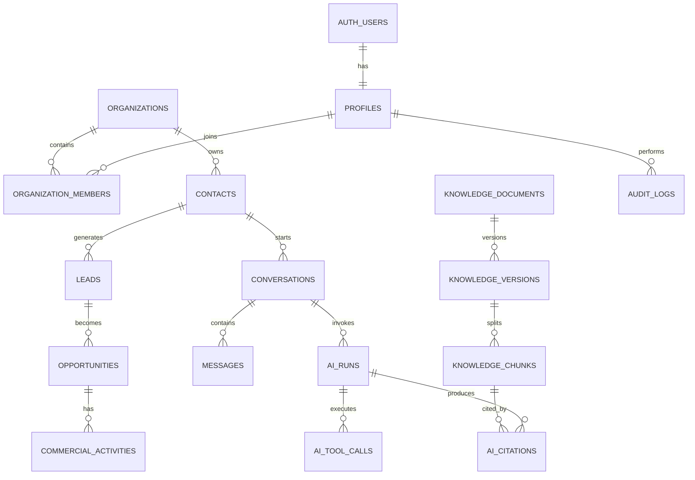

# OmegaLed AI Platform
## Database Architecture Specification

## 1. Scopo

Questo documento definisce l'architettura dati ufficiale della OmegaLed AI Platform.

La base dati deve supportare in modo coerente:

- utenti interni ed esterni;
- ruoli e autorizzazioni;
- aziende, rivenditori, agenti, installatori e clienti;
- lead, opportunità commerciali e attività;
- conversazioni provenienti da sito, WhatsApp e canali futuri;
- messaggi e allegati;
- Knowledge Base e ricerca vettoriale;
- agenti AI, esecuzioni, strumenti e costi;
- documenti, versioni, fonti e indicizzazione;
- audit, sicurezza, consensi e conformità;
- metriche operative e commerciali.

La base dati non deve diventare un deposito casuale di campi aggiunti durante l'emergenza del venerdì pomeriggio. Ogni nuova tabella deve avere uno scopo, un proprietario, regole di accesso e criteri di conservazione.

---

## 2. Tecnologia scelta

### 2.1 Motore principale

- PostgreSQL gestito tramite Supabase;
- estensione `pgvector` per gli embedding;
- Supabase Auth per autenticazione;
- Supabase Storage per file e allegati;
- Row Level Security per l'isolamento dei dati;
- migrazioni SQL versionate nel repository GitHub.

### 2.2 Principi tecnici

1. PostgreSQL è la fonte dati primaria.
2. Nessuna logica critica deve vivere soltanto nel frontend.
3. Tutte le tabelle applicative devono avere RLS abilitata.
4. Le chiavi primarie devono usare UUID.
5. Le date devono essere memorizzate in UTC con `timestamptz`.
6. I dati eliminati operativamente devono usare soft delete quando necessario.
7. Le modifiche sensibili devono essere registrate nell'audit log.
8. Gli embedding non sostituiscono i dati sorgente.
9. I dati CRM importati devono mantenere l'identificativo esterno.
10. Gli schemi devono essere evoluti soltanto tramite migrazioni.

---

## 3. Convenzioni di nomenclatura

### Tabelle

Usare nomi plurali in `snake_case`.

Esempi:

- `organizations`
- `contacts`
- `conversations`
- `knowledge_documents`

### Colonne

Usare `snake_case`.

Campi standard:

```sql
id uuid primary key default gen_random_uuid()
created_at timestamptz not null default now()
updated_at timestamptz not null default now()
created_by uuid null
updated_by uuid null
deleted_at timestamptz null
```

### Chiavi esterne

Formato:

```text
<entita_singolare>_id
```

Esempi:

- `organization_id`
- `contact_id`
- `conversation_id`

### Enum

Gli enum possono essere usati solo per valori realmente stabili. Per stati destinati a evolvere frequentemente è preferibile una tabella di configurazione.

---

## 4. Schema logico generale



---

## 5. Domini principali

La base dati viene suddivisa nei seguenti domini logici:

1. Identity and Access
2. Organizations and Network
3. CRM and Sales
4. Conversations and Messaging
5. AI Orchestration
6. Knowledge Base and RAG
7. Documents and Files
8. Integrations
9. Analytics
10. Governance and Audit

La separazione è logica. Nella prima fase tutte le tabelle possono risiedere nello schema `public`, purché siano protette da RLS. Schemi PostgreSQL dedicati potranno essere introdotti successivamente.

---

# 6. Identity and Access

## 6.1 `profiles`

Estende `auth.users` con i dati applicativi.

| Campo | Tipo | Vincoli | Descrizione |
|---|---|---|---|
| id | uuid | PK, FK auth.users.id | Identità utente |
| first_name | text | not null | Nome |
| last_name | text | not null | Cognome |
| display_name | text | not null | Nome mostrato |
| phone | text | null | Telefono |
| avatar_url | text | null | Immagine profilo |
| locale | text | default `it-IT` | Lingua |
| timezone | text | default `Europe/Rome` | Fuso orario |
| status | text | not null | active, suspended, invited |
| last_seen_at | timestamptz | null | Ultimo accesso applicativo |
| created_at | timestamptz | not null | Creazione |
| updated_at | timestamptz | not null | Modifica |

## 6.2 `roles`

Ruoli di sistema configurabili.

Ruoli iniziali:

- `super_admin`
- `admin`
- `director`
- `sales_manager`
- `sales_agent`
- `technical_manager`
- `support_operator`
- `marketing_operator`
- `dealer`
- `installer`
- `viewer`

## 6.3 `permissions`

Permessi granulari.

Esempi:

- `contacts.read`
- `contacts.write`
- `contacts.delete`
- `leads.assign`
- `knowledge.publish`
- `conversations.takeover`
- `ai.prompts.manage`
- `analytics.read`
- `settings.manage`

## 6.4 Tabelle di collegamento

- `role_permissions`
- `organization_members`
- `member_roles`

Una persona può appartenere a più organizzazioni e avere ruoli differenti in ciascuna.

---

# 7. Organizations and Network

## 7.1 `organizations`

Rappresenta OmegaLed, rivenditori, agenzie, installatori, clienti aziendali e partner.

| Campo | Tipo | Descrizione |
|---|---|---|
| id | uuid | Identificativo |
| parent_organization_id | uuid | Organizzazione padre |
| type | text | internal, dealer, agent, installer, customer, supplier, partner |
| legal_name | text | Ragione sociale |
| trade_name | text | Nome commerciale |
| vat_number | text | Partita IVA |
| tax_code | text | Codice fiscale |
| email | citext | Email principale |
| phone | text | Telefono |
| website | text | Sito |
| status | text | active, prospect, inactive, blocked |
| territory | text | Area commerciale |
| province | text | Provincia |
| region | text | Regione |
| country_code | char(2) | Paese |
| crm_external_id | text | ID Ermete o altro CRM |
| metadata | jsonb | Dati non strutturali |
| created_at | timestamptz | Creazione |
| updated_at | timestamptz | Modifica |
| deleted_at | timestamptz | Soft delete |

### Regole

- La Partita IVA deve essere unica quando valorizzata.
- Un rivenditore può avere più sedi.
- Un agente può essere associato a più rivenditori.
- La cancellazione di una organizzazione non deve cancellare automaticamente conversazioni, audit o documenti fiscali.

## 7.2 `organization_addresses`

Memorizza sedi legali, operative, showroom, magazzini e luoghi di installazione.

## 7.3 `organization_relationships`

Gestisce relazioni molti-a-molti.

Esempi:

- agente gestisce rivenditore;
- installatore serve rivenditore;
- rivenditore appartiene a una rete;
- cliente è assegnato a un commerciale.

Campi principali:

- `source_organization_id`
- `target_organization_id`
- `relationship_type`
- `valid_from`
- `valid_to`
- `is_primary`

---

# 8. Contacts

## 8.1 `contacts`

Rappresenta una persona fisica con cui OmegaLed interagisce.

| Campo | Tipo | Descrizione |
|---|---|---|
| id | uuid | Identificativo |
| organization_id | uuid | Azienda principale |
| first_name | text | Nome |
| last_name | text | Cognome |
| job_title | text | Ruolo |
| email | citext | Email |
| phone | text | Telefono |
| mobile_phone | text | Cellulare |
| whatsapp_phone | text | Numero WhatsApp normalizzato |
| preferred_channel | text | web, whatsapp, email, phone |
| contact_type | text | customer, dealer, installer, lead, internal |
| lifecycle_status | text | new, active, inactive, archived |
| owner_profile_id | uuid | Responsabile interno |
| crm_external_id | text | Identificativo CRM |
| source | text | Provenienza |
| consent_status | text | Stato consenso |
| notes | text | Note operative |
| metadata | jsonb | Estensioni |
| created_at | timestamptz | Creazione |
| updated_at | timestamptz | Modifica |
| deleted_at | timestamptz | Soft delete |

### Deduplicazione

La piattaforma deve eseguire deduplicazione tramite:

1. email normalizzata;
2. telefono in formato E.164;
3. Partita IVA dell'organizzazione;
4. matching probabilistico assistito, mai fusione automatica irreversibile.

---

# 9. CRM and Sales

## 9.1 `leads`

| Campo | Tipo | Descrizione |
|---|---|---|
| id | uuid | Identificativo |
| contact_id | uuid | Contatto |
| organization_id | uuid | Azienda |
| owner_profile_id | uuid | Commerciale assegnato |
| source | text | ads, website, whatsapp, referral, manual |
| source_detail | text | Campagna o dettaglio |
| product_interest | text[] | Prodotti di interesse |
| status | text | new, contacted, qualified, unqualified, converted |
| priority | text | low, normal, high, urgent |
| score | integer | Lead score 0-100 |
| next_action_at | timestamptz | Prossima azione |
| last_contact_at | timestamptz | Ultimo contatto |
| converted_at | timestamptz | Conversione |
| crm_external_id | text | ID CRM |
| created_at | timestamptz | Creazione |
| updated_at | timestamptz | Modifica |

## 9.2 `opportunities`

Rappresenta una trattativa commerciale.

Stati iniziali allineati al flusso OmegaLed:

- `new_request`
- `qualification`
- `proposal_in_progress`
- `proposal_sent`
- `recall_1`
- `recall_2`
- `waiting_response`
- `proposal_expired`
- `to_call_back`
- `won`
- `lost`
- `archived`

Campi principali:

- `lead_id`
- `organization_id`
- `contact_id`
- `owner_profile_id`
- `title`
- `stage`
- `estimated_value`
- `currency`
- `probability`
- `expected_close_date`
- `loss_reason`
- `next_action_at`
- `crm_external_id`

## 9.3 `commercial_activities`

Registra chiamate, email, messaggi, appuntamenti, promemoria e note.

Tipi:

- call
- email
- whatsapp
- meeting
- task
- note
- quote_sent
- follow_up

Ogni attività deve avere:

- autore;
- assegnatario;
- scadenza;
- stato;
- relazione con contatto, lead o opportunità;
- esito;
- tracciabilità verso il sistema esterno.

---

# 10. Conversations and Messaging

## 10.1 `channels`

Canali supportati:

- website_widget
- whatsapp
- admin_console
- email
- api
- future_social

## 10.2 `conversations`

| Campo | Tipo | Descrizione |
|---|---|---|
| id | uuid | Identificativo |
| channel_id | uuid | Canale |
| contact_id | uuid | Contatto noto |
| organization_id | uuid | Organizzazione |
| external_thread_id | text | ID conversazione esterna |
| status | text | open, waiting_user, waiting_operator, closed, archived |
| mode | text | ai, human, hybrid |
| assigned_profile_id | uuid | Operatore assegnato |
| active_agent | text | Agente logico attivo |
| language | text | Lingua |
| started_at | timestamptz | Inizio |
| last_message_at | timestamptz | Ultimo messaggio |
| closed_at | timestamptz | Chiusura |
| summary | text | Sintesi aggiornata |
| sentiment | text | neutral, positive, negative, urgent |
| metadata | jsonb | Dati canale |

## 10.3 `messages`

| Campo | Tipo | Descrizione |
|---|---|---|
| id | uuid | Identificativo |
| conversation_id | uuid | Conversazione |
| parent_message_id | uuid | Messaggio precedente o risposta |
| direction | text | inbound, outbound, internal |
| sender_type | text | contact, operator, ai, system |
| sender_profile_id | uuid | Operatore |
| ai_run_id | uuid | Esecuzione AI associata |
| external_message_id | text | ID canale |
| content_text | text | Testo |
| content_json | jsonb | Contenuto strutturato |
| status | text | queued, sent, delivered, read, failed |
| sent_at | timestamptz | Invio |
| delivered_at | timestamptz | Consegna |
| read_at | timestamptz | Lettura |
| created_at | timestamptz | Creazione |

### Vincoli

- `external_message_id` deve essere unico per canale quando presente.
- I messaggi non devono essere modificati dopo l'invio, salvo rettifiche interne tracciate.
- Le note interne non devono mai essere inviate al cliente.

## 10.4 `message_attachments`

Collega messaggi e file salvati in Supabase Storage.

---

# 11. AI Orchestration

## 11.1 `ai_agents`

Configurazione degli agenti logici.

Agenti iniziali:

- reception
- commercial
- technical
- document
- crm
- marketing
- installer
- analytics

Campi:

- `code`
- `name`
- `description`
- `status`
- `model_policy`
- `prompt_version_id`
- `temperature`
- `max_output_tokens`
- `tools_allowed`
- `fallback_agent_id`

## 11.2 `ai_prompt_versions`

Ogni prompt deve essere versionato.

Campi principali:

- `agent_id`
- `version`
- `system_prompt`
- `developer_prompt`
- `status`
- `effective_from`
- `created_by`
- `change_notes`
- `checksum`

Un prompt pubblicato non deve essere sovrascritto. Deve essere creata una nuova versione.

## 11.3 `ai_runs`

Registra ogni esecuzione AI.

| Campo | Tipo | Descrizione |
|---|---|---|
| id | uuid | Identificativo |
| conversation_id | uuid | Conversazione |
| message_id | uuid | Messaggio generato |
| agent_id | uuid | Agente |
| prompt_version_id | uuid | Prompt usato |
| provider | text | OpenAI |
| model | text | Modello |
| status | text | queued, running, completed, failed, blocked |
| input_tokens | integer | Token input |
| output_tokens | integer | Token output |
| cached_tokens | integer | Token cache |
| estimated_cost | numeric | Costo stimato |
| latency_ms | integer | Latenza |
| confidence_score | numeric | Confidenza applicativa |
| escalation_required | boolean | Necessità operatore |
| safety_result | jsonb | Esito controlli |
| error_code | text | Codice errore |
| started_at | timestamptz | Avvio |
| completed_at | timestamptz | Fine |

## 11.4 `ai_tool_calls`

Registra gli strumenti usati durante una risposta.

Esempi:

- ricerca Knowledge Base;
- recupero scheda prodotto;
- lettura CRM;
- creazione attività;
- generazione documento;
- invio richiesta a operatore.

Campi:

- `ai_run_id`
- `tool_name`
- `request_payload`
- `response_summary`
- `status`
- `latency_ms`
- `error_code`

I payload sensibili devono essere redatti o cifrati secondo la policy di sicurezza.

---

# 12. Knowledge Base and RAG

## 12.1 `knowledge_documents`

Rappresenta il documento logico.

Tipi iniziali:

- product_sheet
- price_list
- manual
- installation_guide
- faq
- commercial_policy
- warranty
- marketing_asset
- internal_procedure
- legal_document

Campi principali:

- `title`
- `document_type`
- `product_family`
- `audience`
- `visibility`
- `status`
- `owner_profile_id`
- `source_system`
- `external_id`
- `valid_from`
- `valid_to`
- `is_authoritative`

## 12.2 `knowledge_versions`

Ogni documento può avere più versioni.

Campi:

- `document_id`
- `version_number`
- `storage_path`
- `mime_type`
- `file_size`
- `checksum`
- `extracted_text`
- `processing_status`
- `published_at`
- `supersedes_version_id`

## 12.3 `knowledge_chunks`

Contiene i frammenti indicizzati.

| Campo | Tipo | Descrizione |
|---|---|---|
| id | uuid | Identificativo |
| version_id | uuid | Versione documento |
| chunk_index | integer | Ordine |
| content | text | Testo |
| token_count | integer | Dimensione |
| heading_path | text[] | Gerarchia titoli |
| page_number | integer | Pagina sorgente |
| metadata | jsonb | Metadati |
| embedding | vector | Vettore |
| embedding_model | text | Modello embedding |
| created_at | timestamptz | Creazione |

### Ricerca ibrida

La ricerca deve combinare:

- similarità vettoriale;
- ricerca full-text PostgreSQL;
- filtri per visibilità;
- filtri per validità temporale;
- priorità delle fonti autorevoli;
- reranking applicativo.

## 12.4 `ai_citations`

Collega una risposta AI ai chunk utilizzati.

Campi:

- `ai_run_id`
- `knowledge_chunk_id`
- `rank`
- `similarity_score`
- `quoted_excerpt`
- `used_in_answer`

Questo consente di ricostruire perché OmegaBot ha risposto in un certo modo. Miracolo raro: un sistema che conserva le prove invece di affidarsi alla memoria collettiva.

---

# 13. Products and Technical Data

## 13.1 `product_families`

Esempi:

- Ledwall outdoor
- Ledwall indoor
- Totem Led
- Totem LCD
- Insegne Led
- Vetrine digitali
- Trasparenti
- Bordocampo
- Controller

## 13.2 `products`

Campi principali:

- `sku`
- `name`
- `family_id`
- `description`
- `status`
- `indoor_outdoor`
- `pitch`
- `brightness_nits`
- `refresh_rate_hz`
- `ip_rating`
- `technology`
- `controller_type`
- `warranty_months`
- `metadata`

Le specifiche variabili e non universali devono essere gestite tramite `product_attributes` e non aggiunte ogni volta come nuove colonne.

## 13.3 `product_variants`

Gestisce misure, configurazioni, colori e versioni.

## 13.4 `product_prices`

I prezzi devono essere versionati.

Campi:

- `product_variant_id`
- `price_type`
- `amount`
- `currency`
- `valid_from`
- `valid_to`
- `customer_segment`
- `is_tax_included`
- `source_document_id`

OmegaBot può comunicare un prezzo solo se esiste una riga valida, autorizzata e non scaduta.

---

# 14. Documents and Files

## 14.1 `files`

Registro centrale dei file.

Campi:

- `storage_bucket`
- `storage_path`
- `original_filename`
- `mime_type`
- `size_bytes`
- `checksum`
- `visibility`
- `virus_scan_status`
- `uploaded_by`
- `created_at`

## 14.2 `file_links`

Collega un file a una o più entità:

- messaggio;
- prodotto;
- opportunità;
- installazione;
- documento Knowledge Base;
- organizzazione.

---

# 15. Installations and Technical Support

## 15.1 `installations`

Campi principali:

- `organization_id`
- `contact_id`
- `opportunity_id`
- `installer_organization_id`
- `site_address_id`
- `scheduled_at`
- `completed_at`
- `status`
- `agreed_amount`
- `currency`
- `notes`

## 15.2 `installation_checklists`

Checklist versionate per tipologia di prodotto.

## 15.3 `installation_reports`

Verbali, collaudi, firme e fotografie.

Vincolo operativo iniziale:

- possibilità di richiedere almeno dieci fotografie;
- associazione delle fotografie a categorie definite;
- registrazione della firma cliente;
- impossibilità di marcare il lavoro completato senza i requisiti obbligatori, salvo deroga tracciata.

## 15.4 `support_tickets`

Campi:

- `contact_id`
- `organization_id`
- `product_id`
- `installation_id`
- `priority`
- `status`
- `category`
- `assigned_profile_id`
- `sla_due_at`
- `resolved_at`

---

# 16. Integrations

## 16.1 `integration_connections`

Configura collegamenti con:

- Ermete CRM;
- WhatsApp Business;
- OpenAI;
- Vercel;
- sistemi email;
- servizi futuri.

I segreti non devono essere memorizzati in chiaro nella tabella. Devono risiedere nel secret manager o nelle variabili ambiente sicure.

## 16.2 `integration_events`

Registra eventi in entrata e uscita.

Campi:

- `connection_id`
- `direction`
- `event_type`
- `external_event_id`
- `payload_hash`
- `status`
- `attempt_count`
- `next_retry_at`
- `processed_at`
- `error_message`

### Idempotenza

Ogni webhook deve essere idempotente tramite chiave unica su:

```text
connection_id + external_event_id
```

## 16.3 `sync_mappings`

Mappa record interni ed esterni.

---

# 17. Analytics

## 17.1 Eventi operativi

Tabella `analytics_events` per eventi applicativi.

Esempi:

- widget_opened
- conversation_started
- lead_created
- operator_takeover
- answer_helpful
- answer_unhelpful
- quote_requested
- knowledge_search_empty

## 17.2 Aggregazioni

Le dashboard non devono calcolare ogni metrica interrogando milioni di righe grezze in tempo reale. Devono essere previste:

- viste materializzate;
- tabelle aggregate giornaliere;
- processi di aggiornamento pianificati;
- metriche per organizzazione, canale, agente e periodo.

## 17.3 Metriche AI

- tasso di risoluzione automatica;
- tasso di escalation;
- costo medio per conversazione;
- latenza media;
- percentuale di risposte con citazioni;
- feedback positivo e negativo;
- ricerche Knowledge Base senza risultato;
- errori per modello e agente.

---

# 18. Governance and Audit

## 18.1 `audit_logs`

Campi obbligatori:

- `actor_profile_id`
- `actor_type`
- `action`
- `entity_type`
- `entity_id`
- `before_data`
- `after_data`
- `ip_address`
- `user_agent`
- `request_id`
- `created_at`

Azioni da registrare sempre:

- modifica ruoli;
- pubblicazione prompt;
- pubblicazione documenti;
- modifica prezzi;
- fusione contatti;
- eliminazione logica;
- esportazione dati;
- accesso a dati sensibili;
- cambio stato opportunità;
- takeover umano di una conversazione.

## 18.2 `consents`

Registra consensi e basi giuridiche.

Campi:

- `contact_id`
- `consent_type`
- `status`
- `legal_basis`
- `source`
- `captured_at`
- `withdrawn_at`
- `evidence_file_id`

## 18.3 Conservazione

Le policy di retention devono essere configurabili per tipologia dati.

Indicazioni iniziali da validare legalmente:

- messaggi commerciali: secondo necessità aziendale e base giuridica;
- log tecnici: durata limitata;
- audit critici: conservazione estesa;
- dati di candidati o contatti non qualificati: cancellazione o anonimizzazione secondo policy;
- embedding: eliminazione coordinata con il documento sorgente.

---

# 19. Row Level Security

## 19.1 Regola generale

RLS deve essere attiva su tutte le tabelle applicative.

## 19.2 Criteri di accesso

Un utente può accedere a un record solo se almeno una condizione è vera:

1. è `super_admin`;
2. appartiene all'organizzazione proprietaria;
3. è assegnatario del record;
4. possiede un ruolo con visibilità territoriale compatibile;
5. accede tramite funzione server autorizzata con service role;
6. il record è esplicitamente pubblico.

## 19.3 Accesso rivenditori

I rivenditori possono vedere:

- la propria organizzazione;
- i propri utenti;
- i propri contatti autorizzati;
- le proprie opportunità;
- i documenti pubblicati per la rete;
- le conversazioni di competenza.

Non possono vedere:

- altri rivenditori;
- margini interni;
- prompt di sistema;
- log completi AI;
- dati direzionali;
- costi provider.

## 19.4 Accesso installatori

Gli installatori vedono solo:

- lavori assegnati;
- documentazione tecnica necessaria;
- contatti operativi strettamente necessari;
- checklist e verbali pertinenti.

---

# 20. Indici e prestazioni

Indici minimi:

```sql
create index on contacts (organization_id);
create index on contacts (owner_profile_id);
create unique index contacts_email_unique
  on contacts (lower(email))
  where email is not null and deleted_at is null;

create index on leads (owner_profile_id, status, next_action_at);
create index on opportunities (owner_profile_id, stage, next_action_at);
create index on conversations (status, last_message_at desc);
create index on messages (conversation_id, created_at);
create index on ai_runs (agent_id, created_at desc);
create index on integration_events (status, next_retry_at);
```

Per i vettori usare un indice adeguato alla versione di pgvector e al volume reale, evitando di scegliere parametri casuali solo perché appaiono autorevoli in un tutorial.

---

# 21. Trigger e funzioni database

Funzioni iniziali:

- aggiornamento automatico `updated_at`;
- normalizzazione email;
- normalizzazione telefono;
- scrittura audit per tabelle critiche;
- calcolo stato opportunità;
- creazione profilo dopo registrazione;
- controllo validità prezzo;
- claim atomico di un job;
- incremento sicuro dei tentativi webhook.

La logica di business complessa deve rimanere nei servizi backend. I trigger devono essere limitati a integrità, audit e automatismi semplici.

---

# 22. Migrazioni

Percorso previsto:

```text
/supabase/migrations
```

Formato file:

```text
YYYYMMDDHHMMSS_description.sql
```

Regole:

1. Una migrazione applicata non deve essere modificata.
2. Ogni modifica successiva crea una nuova migrazione.
3. Le migrazioni distruttive devono essere separate in più fasi.
4. Prima si aggiunge, poi si migra, poi si rimuove.
5. Ogni migrazione deve essere testata su ambiente preview o staging.
6. Le policy RLS devono essere versionate insieme alle tabelle.
7. I seed di sviluppo non devono contenere dati personali reali.

---

# 23. Backup e ripristino

Requisiti:

- backup automatici del database;
- Point-in-Time Recovery quando disponibile;
- verifica periodica del ripristino;
- backup separato dei file critici;
- documentazione della procedura di disaster recovery;
- RPO e RTO definiti prima della produzione.

Obiettivi iniziali:

- RPO massimo: 24 ore nella fase MVP, da ridurre successivamente;
- RTO massimo: 8 ore nella fase MVP;
- ripristino testato almeno trimestralmente.

---

# 24. Dati sensibili e cifratura

Dati sensibili:

- credenziali;
- token di integrazione;
- dati personali;
- numeri di telefono;
- email;
- contenuti conversazioni;
- documenti firmati;
- log con payload esterni.

Regole:

- TLS in transito;
- cifratura del provider a riposo;
- segreti fuori dal database applicativo;
- accessi amministrativi tracciati;
- minimizzazione dei payload nei log;
- redazione dei dati sensibili prima di inviarli ai provider quando non necessari.

---

# 25. Qualità dei dati

Controlli richiesti:

- campi obbligatori per stato;
- codici paese validi;
- email normalizzate;
- telefoni E.164;
- date coerenti;
- prezzi non negativi;
- probabilità da 0 a 100;
- valute ISO 4217;
- stati tramite lookup controllati;
- divieto di record orfani.

Dashboard qualità dati:

- contatti duplicati;
- lead senza assegnatario;
- attività scadute;
- opportunità senza prossima azione;
- documenti scaduti ma ancora pubblicati;
- prezzi senza fonte;
- chunk non indicizzati;
- webhook bloccati;
- messaggi falliti.

---

# 26. Criteri di accettazione

La prima versione dell'architettura database è accettata quando:

- tutte le entità MVP sono definite;
- le relazioni principali sono documentate;
- ogni tabella applicativa ha una policy RLS;
- utenti interni, rivenditori e installatori sono isolati correttamente;
- conversazioni e messaggi sono tracciabili;
- esecuzioni AI, token, costi e citazioni sono registrati;
- i documenti Knowledge Base sono versionati;
- la ricerca vettoriale rispetta i permessi;
- i webhook sono idempotenti;
- le modifiche critiche producono audit;
- i dati CRM mantengono gli identificativi esterni;
- le migrazioni sono ripetibili su un database vuoto;
- backup e ripristino sono documentati;
- non esistono segreti nel database o nel repository.

---

# 27. Roadmap dati

## Fase 1 - Fondazioni

- profili;
- ruoli e permessi;
- organizzazioni;
- contatti;
- conversazioni;
- messaggi;
- Knowledge Base;
- AI runs;
- audit.

## Fase 2 - Commerciale

- lead;
- opportunità;
- attività;
- sincronizzazione Ermete;
- assegnazioni territoriali;
- dashboard rete.

## Fase 3 - Tecnico

- prodotti;
- installazioni;
- checklist;
- verbali;
- ticket;
- allegati e fotografie.

## Fase 4 - Ottimizzazione

- data warehouse leggero;
- viste materializzate;
- scoring avanzato;
- deduplicazione assistita;
- metriche predittive;
- archiviazione a lungo termine.

---

# 28. Decisioni architetturali

## ADR-DATA-001 - PostgreSQL e Supabase

**Decisione:** utilizzare PostgreSQL tramite Supabase.

**Motivazione:** database relazionale maturo, autenticazione integrata, RLS, storage, funzioni server e supporto pgvector.

## ADR-DATA-002 - UUID come chiavi primarie

**Decisione:** usare UUID per le entità applicative.

**Motivazione:** integrazioni distribuite, importazioni e creazione record offline o asincrona.

## ADR-DATA-003 - Versionamento immutabile dei prompt

**Decisione:** un prompt pubblicato non viene modificato.

**Motivazione:** audit, riproducibilità e controllo qualità.

## ADR-DATA-004 - Ricerca ibrida

**Decisione:** combinare full-text, vettori, filtri e reranking.

**Motivazione:** la sola similarità vettoriale non garantisce precisione, validità o rispetto dei permessi.

## ADR-DATA-005 - Soft delete selettivo

**Decisione:** usare `deleted_at` per entità operative che richiedono recupero o audit.

**Motivazione:** evitare perdita accidentale e mantenere riferimenti storici.

---

# 29. Questioni aperte

Da definire prima della produzione:

- dettagli API di Ermete;
- regole territoriali definitive;
- struttura prezzi e listini riservati;
- durata retention per ciascun dato;
- requisiti legali per registrazione e trascrizione chiamate;
- modello embedding definitivo;
- limiti dimensione documenti;
- frequenza sincronizzazione CRM;
- strategia multi-tenant futura;
- RPO e RTO definitivi.

---

# 30. Regola finale

La base dati deve riflettere il funzionamento reale di OmegaLed, non costringere OmegaLed a lavorare secondo tabelle progettate male.

Ogni nuova colonna deve rispondere a quattro domande:

1. Chi la usa?
2. Per quale processo?
3. Chi può leggerla o modificarla?
4. Per quanto tempo deve essere conservata?

Se nessuno sa rispondere, la colonna non va aggiunta.
