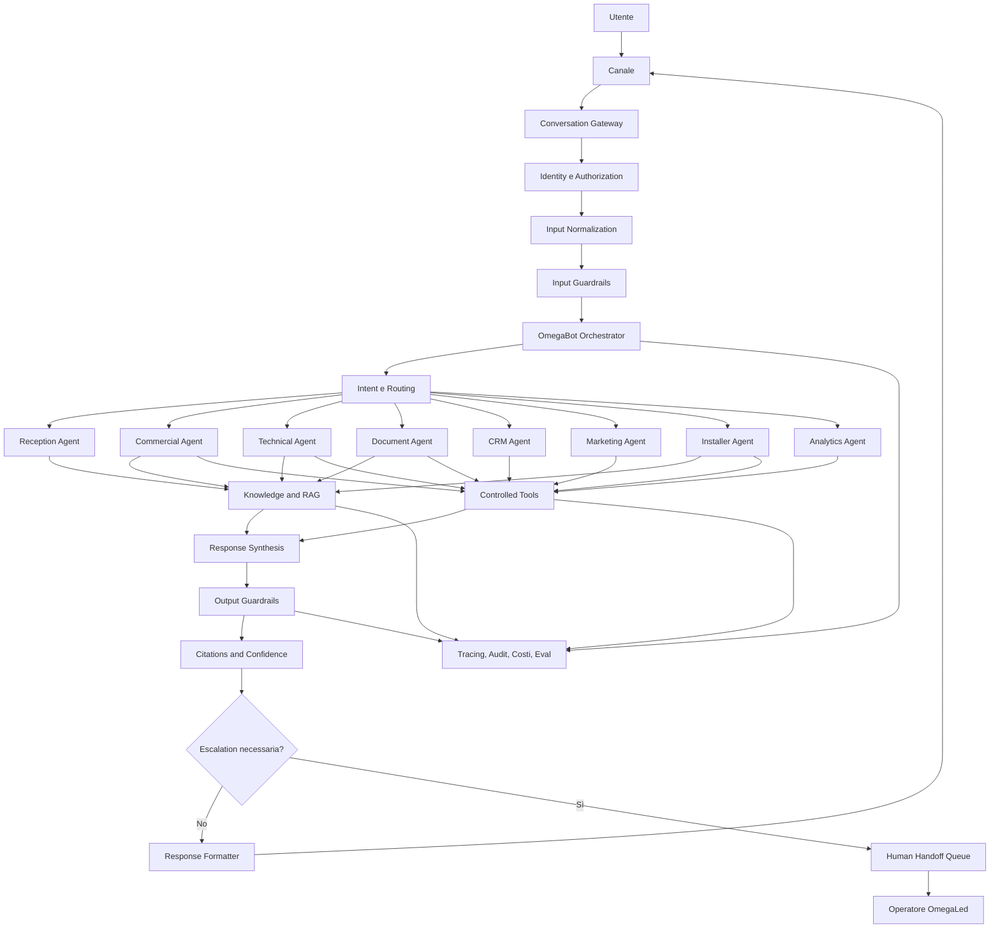
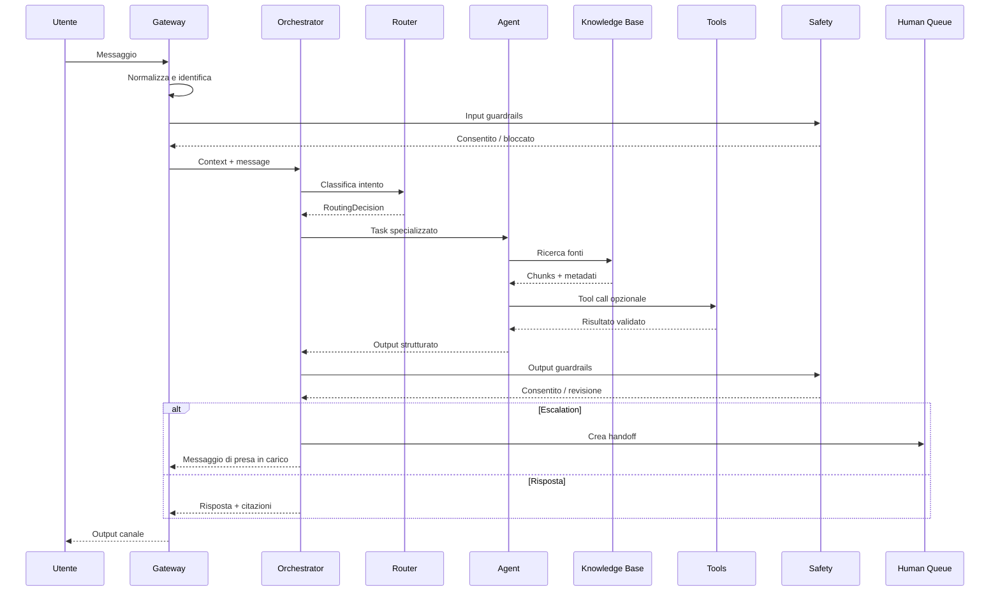
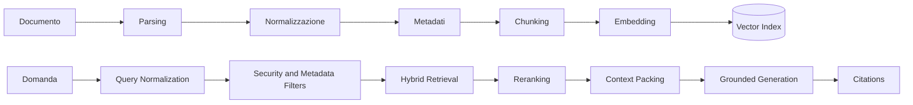

# OmegaLed AI Platform
## AI Architecture Specification

> Questo documento definisce l'architettura AI ufficiale della OmegaLed AI Platform. Descrive come OmegaBot interpreta le richieste, seleziona gli agenti, usa la Knowledge Base, chiama strumenti aziendali, produce risposte verificabili, gestisce i rischi e passa il controllo a un operatore umano.

---

## 1. Scopo

La componente AI della piattaforma non deve essere costruita come un singolo prompt collegato a un modello linguistico.

Deve essere progettata come un sistema composto da:

- un orchestratore centrale;
- agenti specializzati;
- strumenti applicativi controllati;
- memoria conversazionale;
- Knowledge Base con ricerca semantica;
- regole commerciali e tecniche deterministiche;
- guardrail di input, output e tool;
- tracciamento completo di ogni esecuzione;
- valutazioni automatiche;
- escalation umana.

L'obiettivo non è produrre il maggior numero possibile di risposte. L'obiettivo è produrre risposte utili, coerenti, verificabili e compatibili con le procedure OmegaLed.

---

## 2. Obiettivi architetturali

La piattaforma AI deve:

1. presentare un'unica identità all'utente: **OmegaBot**;
2. nascondere la complessità dei diversi agenti interni;
3. distinguere richieste commerciali, tecniche, documentali, operative e amministrative;
4. usare esclusivamente dati autorizzati per il ruolo e il canale;
5. citare le fonti quando una risposta deriva dalla Knowledge Base;
6. evitare l'invenzione di prezzi, disponibilità o specifiche tecniche;
7. richiedere conferma umana per azioni sensibili;
8. registrare modello, prompt, tool, fonti, latenza, token e costo;
9. funzionare su sito, dashboard, WhatsApp e futuri canali;
10. degradare in modo controllato quando un servizio esterno non è disponibile;
11. permettere il miglioramento continuo tramite eval, feedback e versionamento;
12. mantenere separati ragionamento AI, regole di business e accesso ai dati.

---

## 3. Non-obiettivi iniziali

La prima versione non deve:

- consentire all'AI di modificare liberamente il database;
- inviare preventivi definitivi senza revisione;
- promettere disponibilità di magazzino non verificata;
- approvare sconti o condizioni commerciali;
- effettuare pagamenti;
- firmare documenti;
- modificare configurazioni Led da remoto;
- fornire istruzioni elettriche rischiose senza documentazione approvata;
- agire come sostituto del responsabile tecnico;
- usare Internet come fonte primaria per dati OmegaLed;
- conservare memoria personale illimitata;
- mostrare all'utente i prompt interni o il ragionamento privato del modello.

---

## 4. Principi fondamentali

### 4.1 Una sola identità esterna

L'utente parla sempre con OmegaBot.

Gli agenti interni non devono presentarsi con nomi differenti, salvo strumenti amministrativi di debug visibili soltanto agli utenti autorizzati.

### 4.2 Specializzazione interna

Ogni agente deve avere:

- scopo definito;
- dominio limitato;
- strumenti autorizzati;
- fonti consentite;
- output strutturato;
- criteri di escalation;
- test dedicati.

### 4.3 Regole deterministiche prima del linguaggio naturale

Quando un risultato può essere calcolato o verificato tramite codice, database o regola aziendale, il sistema deve usare quella fonte invece di chiedere al modello di indovinare.

Esempi:

- calcolo delle dimensioni;
- ricerca di un prezzo approvato;
- verifica del ruolo utente;
- disponibilità di un documento;
- stato di un lead;
- presenza di un rivenditore in una provincia;
- validazione di email e numero di telefono.

### 4.4 Nessun accesso implicito

Un agente non eredita automaticamente tutti gli strumenti disponibili nella piattaforma.

Ogni strumento deve essere assegnato esplicitamente all'agente e verificato dal backend.

### 4.5 Tracciabilità completa

Ogni risposta deve essere ricostruibile attraverso:

- `conversation_id`;
- `message_id`;
- `ai_run_id`;
- agente selezionato;
- versione del prompt;
- modello logico utilizzato;
- input normalizzato;
- fonti recuperate;
- tool invocati;
- autorizzazioni applicate;
- output grezzo;
- output finale;
- guardrail eseguiti;
- latenza;
- token;
- costo stimato;
- eventuale intervento umano.

### 4.6 Risposta prudente, non evasiva

Quando i dati non sono sufficienti, OmegaBot deve:

1. dichiarare cosa manca;
2. chiedere un'informazione utile;
3. proporre il passaggio a un operatore quando necessario;
4. evitare formule vaghe che fingano competenza.

---

## 5. Architettura logica



---

## 6. Pattern di orchestrazione

### 6.1 Pattern scelto

La piattaforma utilizza un modello ibrido:

- **manager pattern** per mantenere OmegaBot come unico proprietario della risposta;
- **handoff controllato** quando uno specialista deve gestire una fase completa;
- **workflow deterministico** per operazioni sensibili o fortemente strutturate.

### 6.2 Quando usare il manager pattern

Il manager pattern è preferito quando:

- più specialisti devono contribuire alla stessa risposta;
- la risposta finale deve essere uniforme;
- è necessario applicare guardrail comuni;
- l'utente non deve percepire il cambio di agente;
- il contesto commerciale e tecnico deve essere combinato.

Esempio:

> “Mi serve un Ledwall outdoor 4×3 per un impianto sportivo, quanto costa e come si installa?”

Il Commercial Agent può verificare configurazione e prezzo, mentre il Technical Agent controlla installazione e vincoli. OmegaBot sintetizza un'unica risposta.

### 6.3 Quando usare un handoff

Un handoff interno è consentito quando:

- la richiesta appartiene chiaramente a un solo dominio;
- il dominio richiede istruzioni e strumenti molto specifici;
- il passaggio riduce il rischio di errore;
- l'agente specialista produce direttamente l'output del turno.

### 6.4 Quando non usare un agente autonomo

Non usare un agente autonomo per:

- aggiornamenti semplici di record;
- operazioni CRUD standard;
- calcoli deterministici;
- autorizzazioni;
- invio di email o messaggi senza approvazione;
- applicazione di prezzi;
- selezione di destinatari;
- cancellazione di dati.

Queste operazioni devono essere eseguite da servizi applicativi con validazione esplicita.

---

## 7. Componenti principali

### 7.1 Conversation Gateway

Responsabilità:

- ricevere messaggi da sito, dashboard, WhatsApp e API;
- normalizzare il formato;
- assegnare `conversation_id` e `message_id`;
- identificare il canale;
- applicare limiti di frequenza;
- filtrare allegati non supportati;
- associare utente, contatto e organizzazione;
- inviare il messaggio all'orchestratore.

### 7.2 Identity Context Builder

Costruisce il contesto autorizzativo minimo:

```ts
interface IdentityContext {
  userId?: string;
  contactId?: string;
  organizationId?: string;
  roles: string[];
  permissions: string[];
  channel: 'web' | 'admin' | 'whatsapp' | 'api';
  locale: string;
  timezone: string;
  authenticated: boolean;
  consentFlags: Record<string, boolean>;
}
```

Il modello non deve decidere i permessi. Riceve soltanto strumenti già filtrati dal backend.

### 7.3 Input Normalizer

Funzioni:

- pulizia del testo;
- preservazione del significato originale;
- riconoscimento della lingua;
- estrazione di riferimenti a prodotti, misure, luoghi e persone;
- associazione degli allegati;
- classificazione di contenuti sospetti;
- deduplicazione dei messaggi ripetuti;
- rimozione di markup non necessario.

Non deve correggere automaticamente dati tecnici ambigui.

### 7.4 OmegaBot Orchestrator

Responsabilità:

- comprendere l'obiettivo del turno;
- selezionare il workflow;
- decidere quali agenti consultare;
- costruire il contesto minimo;
- coordinare le chiamate agli strumenti;
- unificare gli output;
- applicare le policy globali;
- produrre il formato finale per il canale;
- determinare se è necessaria escalation.

### 7.5 Agent Registry

Ogni agente è registrato tramite configurazione versionata.

```ts
interface AgentDefinition {
  key: string;
  name: string;
  version: string;
  status: 'draft' | 'active' | 'deprecated';
  purpose: string;
  promptVersion: string;
  modelProfile: string;
  allowedToolKeys: string[];
  allowedKnowledgeScopes: string[];
  inputSchema?: string;
  outputSchema: string;
  maxTurns: number;
  timeoutMs: number;
  requiresHumanApprovalFor: string[];
  escalationRules: string[];
}
```

---

## 8. Agenti ufficiali

### 8.1 Reception Agent

**Scopo**

Accogliere, comprendere e classificare le richieste.

**Responsabilità**

- identificare l'intento principale;
- raccogliere dati minimi;
- riconoscere cliente, rivenditore, installatore o prospect;
- rispondere alle domande generali semplici;
- indirizzare la richiesta al dominio corretto;
- evitare interrogatori lunghi e moduli travestiti da conversazione.

**Strumenti consentiti**

- ricerca FAQ pubbliche;
- ricerca rivenditore autorizzato;
- creazione lead preliminare;
- richiesta contatto umano.

**Escalation**

- utente arrabbiato;
- richiesta legale;
- reclamo formale;
- incidente di sicurezza;
- richiesta non classificabile dopo due tentativi.

### 8.2 Commercial Agent

**Scopo**

Supportare la qualificazione commerciale e la preparazione di proposte.

**Responsabilità**

- comprendere applicazione, ambiente, dimensione, distanza di visione e obiettivo;
- suggerire famiglie prodotto compatibili;
- verificare prezzi approvati;
- spiegare acquisto e noleggio operativo;
- preparare una bozza di opportunità;
- indicare informazioni mancanti;
- proporre il passaggio al commerciale competente.

**Divieti**

- inventare prezzi;
- applicare sconti;
- garantire consegne;
- dichiarare disponibilità senza tool;
- produrre un'offerta vincolante;
- promettere caratteristiche non presenti nelle schede approvate.

**Strumenti consentiti**

- `search_products`;
- `get_product_variants`;
- `get_approved_price`;
- `calculate_display_configuration`;
- `search_dealers_by_area`;
- `create_or_update_lead_draft`;
- `create_quote_draft`;
- `request_sales_handoff`.

### 8.3 Technical Agent

**Scopo**

Fornire supporto tecnico basato su documentazione verificata.

**Responsabilità**

- confrontare specifiche;
- spiegare pitch, luminosità, refresh, protezione e gestione;
- individuare documenti tecnici pertinenti;
- supportare diagnosi iniziale;
- raccogliere dati per ticket;
- distinguere ipotesi da dati confermati.

**Regole critiche**

- nessuna specifica deve essere generata per analogia;
- ogni dato numerico deve provenire da una fonte approvata o da un calcolo deterministico;
- procedure elettriche o strutturali rischiose richiedono documento ufficiale o tecnico umano;
- in presenza di rischio per persone o beni, interrompere l'istruzione e fare escalation.

**Strumenti consentiti**

- ricerca schede tecniche;
- ricerca manuali;
- confronto prodotti;
- apertura ticket;
- caricamento log e fotografie;
- verifica stato assistenza.

### 8.4 Document Agent

**Scopo**

Preparare bozze documentali coerenti con i dati aziendali.

**Output supportati**

- bozza preventivo;
- scheda prodotto;
- riepilogo progetto;
- incarico installatore;
- checklist;
- verbale di collaudo;
- email commerciale;
- riepilogo conversazione;
- documento interno.

**Regole**

- usare template versionati;
- non modificare clausole legali senza autorizzazione;
- distinguere chiaramente bozza e documento approvato;
- includere origine dei dati;
- bloccare la generazione se mancano campi obbligatori.

### 8.5 CRM Agent

**Scopo**

Interpretare richieste relative a contatti, lead, opportunità e attività, lasciando l'esecuzione ai servizi CRM.

**Responsabilità**

- cercare record;
- proporre aggiornamenti;
- sintetizzare storico;
- suggerire prossima azione;
- creare bozze di attività;
- identificare duplicati probabili.

**Azioni con approvazione**

- modifica assegnatario;
- cambio fase opportunità;
- archiviazione;
- cancellazione;
- invio comunicazione;
- aggiornamento massivo.

### 8.6 Marketing Agent

**Scopo**

Produrre materiale marketing coerente con brand, catalogo e canale.

**Responsabilità**

- ideare contenuti;
- adattare testi per social, sito, email e video;
- verificare nomenclatura prodotti;
- rispettare lo stile OmegaLed;
- non creare dichiarazioni tecniche o commerciali non approvate.

**Fonti**

- Brand Guide;
- Product Catalog;
- campagne approvate;
- claim autorizzati;
- archivio contenuti.

### 8.7 Installer Agent

**Scopo**

Assistere installatori autorizzati prima, durante e dopo l'installazione.

**Responsabilità**

- mostrare checklist specifiche;
- raccogliere foto obbligatorie;
- verificare documenti necessari;
- guidare la compilazione del verbale;
- aprire ticket;
- segnalare passaggi non completati.

**Limitazioni**

- accessibile solo a utenti autorizzati;
- non sostituisce manuali e responsabile tecnico;
- non autorizza varianti strutturali;
- non convalida autonomamente un collaudo.

### 8.8 Analytics Agent

**Scopo**

Interpretare metriche e produrre sintesi operative.

**Responsabilità**

- leggere dataset autorizzati;
- spiegare variazioni;
- individuare anomalie;
- generare riepiloghi;
- suggerire verifiche;
- non confondere correlazione e causa.

**Output**

- numeri con periodo e fonte;
- confronto con periodo precedente;
- livello di confidenza;
- eventuali dati mancanti;
- spiegazione sintetica.

---

## 9. Classificazione dell'intento

### 9.1 Tassonomia iniziale

```text
general_information
product_discovery
product_comparison
technical_specification
technical_support
quote_request
rental_request
dealer_search
installer_support
document_generation
crm_lookup
crm_update_request
marketing_content
analytics_query
complaint
privacy_request
human_contact
unknown
```

### 9.2 Output del router

```ts
interface RoutingDecision {
  primaryIntent: string;
  secondaryIntents: string[];
  confidence: number;
  selectedWorkflow: string;
  selectedAgents: string[];
  requiredEntities: string[];
  missingEntities: string[];
  riskLevel: 'low' | 'medium' | 'high' | 'critical';
  requiresAuthentication: boolean;
  requiresHuman: boolean;
  rationaleCode: string;
}
```

`rationaleCode` deve essere un codice controllato, non una spiegazione libera del ragionamento interno.

### 9.3 Soglie iniziali

- confidenza ≥ 0,85: procedere;
- confidenza 0,60–0,84: procedere con domanda di chiarimento mirata;
- confidenza < 0,60: usare Reception Agent o escalation;
- rischio alto o critico: non affidarsi soltanto alla confidenza del classificatore.

Le soglie devono essere validate con eval, non trattate come verità metafisiche scolpite nella roccia.

---

## 10. Ciclo di esecuzione di un turno



### 10.1 Limiti del ciclo

Ogni run deve avere:

- timeout totale;
- numero massimo di turni interni;
- numero massimo di tool call;
- limite di token;
- limite di costo;
- limite di documenti recuperati;
- protezione dai loop;
- idempotency key per azioni scriventi.

Valori iniziali raccomandati:

```yaml
max_internal_turns: 8
max_tool_calls: 12
max_retrieved_chunks: 12
soft_timeout_ms: 20000
hard_timeout_ms: 45000
```

I valori sono configurabili per workflow.

---

## 11. Contesto e memoria

### 11.1 Tipi di memoria

La piattaforma distingue:

1. **turn context**: dati del singolo turno;
2. **conversation context**: storico recente necessario alla continuità;
3. **working memory**: fatti estratti e temporanei;
4. **customer context**: dati autorizzati del contatto e dell'organizzazione;
5. **business memory**: informazioni persistenti presenti nel database o nella Knowledge Base;
6. **operator notes**: note umane con livello di riservatezza.

### 11.2 Regola di persistenza

Il modello non decide autonomamente cosa conservare.

La persistenza avviene soltanto tramite servizi applicativi che verificano:

- utilità;
- consenso;
- categoria del dato;
- durata di conservazione;
- visibilità;
- proprietario;
- possibilità di rettifica o cancellazione.

### 11.3 Conversation summary

Le conversazioni lunghe devono essere compattate in una sintesi strutturata.

```ts
interface ConversationSummary {
  userGoal: string;
  knownFacts: Array<{ key: string; value: string; sourceMessageId: string }>;
  openQuestions: string[];
  decisions: string[];
  proposedProducts: string[];
  humanCommitments: string[];
  riskFlags: string[];
  lastUpdatedAt: string;
}
```

La sintesi non deve sostituire i messaggi originali nell'audit.

### 11.4 Dati da non memorizzare come preferenza

- dati sanitari non necessari;
- password o segreti;
- numeri completi di carte;
- documenti identificativi non richiesti dal processo;
- opinioni sensibili;
- informazioni su terzi non necessarie;
- contenuti rimossi dall'utente.

---

## 12. Knowledge Base e RAG

### 12.1 Ordine delle fonti

Per dati OmegaLed l'ordine di fiducia è:

1. database operativo verificato;
2. documento ufficiale pubblicato e vigente;
3. scheda tecnica approvata;
4. listino approvato;
5. manuale del produttore approvato;
6. documento interno in revisione;
7. contenuto marketing approvato;
8. fonte esterna autorizzata;
9. conoscenza generale del modello.

La conoscenza generale del modello non può sostituire una fonte aziendale mancante per prezzi o specifiche.

### 12.2 Pipeline RAG



### 12.3 Filtri obbligatori

Prima della ricerca semantica applicare:

- organizzazione;
- ruolo;
- stato documento;
- lingua;
- categoria;
- prodotto;
- validità temporale;
- livello di riservatezza;
- canale;
- data di pubblicazione.

### 12.4 Contesto recuperato

Ogni chunk deve includere:

- `document_id`;
- `version_id`;
- `chunk_id`;
- titolo;
- sezione;
- testo;
- pagina o righe;
- prodotto associato;
- stato di approvazione;
- data di validità;
- livello di accesso;
- punteggio di recupero;
- punteggio di reranking.

### 12.5 Regole di risposta grounded

OmegaBot deve:

- distinguere fatti da suggerimenti;
- citare la fonte per dati tecnici e commerciali;
- non fondere valori discordanti senza segnalarlo;
- preferire il documento più recente approvato;
- dichiarare quando una fonte è scaduta;
- non usare documenti in bozza per risposte pubbliche;
- interrompere la risposta se le fonti sono insufficienti per un dato critico.

### 12.6 Conflitto tra fonti

In caso di conflitto:

1. non scegliere casualmente;
2. confrontare stato, versione e data;
3. preferire la fonte ufficiale vigente;
4. registrare il conflitto;
5. mostrare un avviso all'operatore;
6. fare escalation se il conflitto influenza prezzo, sicurezza o conformità.

---

## 13. Tool architecture

### 13.1 Principio

Un tool è un contratto applicativo, non una scorciatoia per dare al modello accesso libero ai sistemi.

Ogni tool deve avere:

- nome stabile;
- descrizione precisa;
- schema di input;
- schema di output;
- permessi richiesti;
- timeout;
- limiti;
- idempotenza;
- audit;
- gestione errori;
- eventuale approvazione umana.

### 13.2 Catalogo iniziale

#### Knowledge tools

- `search_knowledge`;
- `get_document_section`;
- `compare_document_versions`;
- `list_product_documents`.

#### Product tools

- `search_products`;
- `get_product`;
- `get_product_variants`;
- `compare_products`;
- `get_approved_price`;
- `calculate_display_configuration`.

#### CRM tools

- `search_contacts`;
- `get_contact_summary`;
- `search_leads`;
- `create_lead_draft`;
- `create_activity_draft`;
- `request_crm_update_approval`.

#### Network tools

- `search_dealers_by_area`;
- `search_installers_by_area`;
- `get_partner_status`;
- `request_partner_contact`.

#### Document tools

- `get_template`;
- `validate_template_fields`;
- `render_document_draft`;
- `request_document_approval`.

#### Support tools

- `create_ticket_draft`;
- `attach_ticket_file`;
- `get_ticket_status`;
- `request_technical_handoff`.

#### Communication tools

- `create_email_draft`;
- `create_whatsapp_draft`;
- `request_send_approval`.

### 13.3 Tool risk levels

| Livello | Tipo | Esempi | Approvazione |
|---|---|---|---|
| R0 | sola lettura pubblica | FAQ, catalogo pubblico | no |
| R1 | sola lettura autenticata | dati contatto, ticket | no, con permesso |
| R2 | creazione bozza | lead, email, documento | no, ma audit |
| R3 | modifica dati | fase CRM, assegnazione | sì |
| R4 | comunicazione esterna | invio email/WhatsApp | sì |
| R5 | azione critica | cancellazione, firma, prezzo vincolante | doppia conferma o vietata |

### 13.4 Validazione

Gli input devono essere validati con schema tipizzato prima dell'esecuzione.

Esempio:

```ts
const GetApprovedPriceInput = z.object({
  productId: z.string().uuid(),
  variantId: z.string().uuid().optional(),
  customerType: z.enum(['customer', 'dealer', 'installer', 'internal']),
  currency: z.literal('EUR'),
  validAt: z.string().datetime(),
});
```

Il backend deve ricalcolare o verificare i valori sensibili. Non deve fidarsi dell'input generato dal modello.

### 13.5 Human approval

Il sistema deve creare una richiesta di approvazione con:

- azione proposta;
- dati prima e dopo;
- motivazione operativa sintetica;
- utente richiedente;
- agente proponente;
- scadenza;
- approvatore richiesto;
- esito;
- timestamp.

---

## 14. Prompt architecture

### 14.1 Strati del prompt

Il prompt finale viene composto da strati separati:

1. policy di piattaforma;
2. identità OmegaBot;
3. istruzioni dell'agente;
4. regole del canale;
5. contesto autorizzativo;
6. contesto conversazionale;
7. fonti recuperate;
8. definizioni degli strumenti;
9. formato di output;
10. richiesta utente.

### 14.2 Versionamento

Ogni prompt deve avere:

- identificativo;
- versione semantica;
- stato;
- autore;
- data;
- changelog;
- agenti associati;
- dataset di eval;
- metriche prima e dopo la pubblicazione.

### 14.3 Regole di scrittura

I prompt devono:

- usare istruzioni esplicite;
- separare obblighi, divieti e preferenze;
- evitare contraddizioni;
- definire quando usare i tool;
- definire quando chiedere chiarimenti;
- definire quando fare escalation;
- specificare il formato di output;
- evitare esempi che introducono dati aziendali falsi;
- non contenere segreti.

### 14.4 Prompt injection

Qualsiasi testo proveniente da utenti, documenti o tool deve essere trattato come dato non affidabile.

I documenti recuperati non possono:

- modificare le policy;
- autorizzare nuovi strumenti;
- cambiare ruolo utente;
- richiedere la rivelazione del prompt;
- ordinare azioni esterne;
- disabilitare i guardrail.

### 14.5 Template base dell'agente

```text
IDENTITÀ
Sei un componente interno di OmegaBot. Non presentarti con un nome separato.

SCOPO
[responsabilità specifica]

FONTI CONSENTITE
[scope Knowledge Base e database]

STRUMENTI
[tool autorizzati]

OBBLIGHI
[regole verificabili]

DIVIETI
[azioni proibite]

ESCALATION
[condizioni]

OUTPUT
[schema strutturato]
```

---

## 15. Structured outputs

### 15.1 Regola

Gli output interni tra router, agenti e orchestratore devono essere strutturati e validati.

Il testo libero è riservato alla risposta finale o a campi esplicitamente previsti.

### 15.2 Agent result

```ts
interface AgentResult<T> {
  status: 'completed' | 'needs_clarification' | 'needs_human' | 'failed';
  data?: T;
  userMessageDraft?: string;
  facts: Array<{
    key: string;
    value: string;
    sourceType: 'database' | 'document' | 'calculation' | 'user';
    sourceId?: string;
  }>;
  citations: Array<{
    documentId: string;
    versionId: string;
    chunkId: string;
    label: string;
  }>;
  missingInformation: string[];
  warnings: string[];
  confidence: number;
  proposedActions: ProposedAction[];
}
```

### 15.3 Proposed action

```ts
interface ProposedAction {
  actionKey: string;
  riskLevel: 'R0' | 'R1' | 'R2' | 'R3' | 'R4' | 'R5';
  parameters: Record<string, unknown>;
  requiresApproval: boolean;
  approvalRole?: string;
  idempotencyKey?: string;
}
```

---

## 16. Confidenza e qualità

### 16.1 La confidenza non è una sensazione del modello

Il livello di confidenza deve essere calcolato usando segnali osservabili:

- qualità delle fonti;
- accordo tra fonti;
- presenza dei campi obbligatori;
- punteggio di retrieval;
- risultato delle validazioni;
- esito dei tool;
- ambiguità dell'intento;
- precedenti errori nel workflow.

### 16.2 Classi di risposta

| Classe | Condizione | Comportamento |
|---|---|---|
| Verified | dati da DB o fonte ufficiale vigente | rispondere e citare |
| Supported | fonti coerenti ma non definitive | rispondere con limite dichiarato |
| Incomplete | mancano dati necessari | chiedere chiarimento |
| Conflicting | fonti discordanti | segnalare ed escalare |
| Unsafe | rischio operativo o policy | bloccare e passare a umano |

### 16.3 Dati numerici

Prezzi, dimensioni, consumi, luminosità, pixel, date, canoni e quantità devono essere marcati internamente con origine e data di validità.

---

## 17. Safety e guardrail

### 17.1 Livelli

- input guardrails;
- retrieval guardrails;
- tool input guardrails;
- tool output guardrails;
- output guardrails;
- business rule validation;
- human approval.

### 17.2 Input guardrails

Devono rilevare:

- prompt injection;
- tentativi di accesso non autorizzato;
- segreti o credenziali;
- spam;
- contenuti illegali;
- richieste di cancellazione o modifica sensibile;
- linguaggio minaccioso;
- allegati pericolosi;
- dati personali non necessari.

### 17.3 Output guardrails

Devono verificare:

- assenza di prezzi inventati;
- assenza di specifiche non citate;
- assenza di segreti;
- assenza di dati di altri clienti;
- presenza di disclaimer quando richiesto;
- coerenza con il ruolo;
- corretto stato di bozza;
- correttezza del formato;
- presenza di fonti per claim tecnici.

### 17.4 Tool guardrails

Ogni tool deve verificare:

- identità;
- permesso;
- ambito organizzazione;
- stato della sessione;
- schema;
- limiti;
- rischio;
- approvazione;
- idempotenza.

### 17.5 Escalation immediata

Escalare senza ulteriori tentativi quando:

- esiste rischio elettrico, strutturale o per la sicurezza;
- un cliente minaccia azioni legali;
- viene segnalata una violazione dati;
- il sistema rileva compromissione dell'account;
- una fonte ufficiale è in conflitto con un'altra;
- è richiesto un prezzo vincolante non disponibile;
- un utente chiede la cancellazione di dati personali;
- un'azione richiede firma o responsabilità professionale.

---

## 18. Human in the loop

### 18.1 Tipi di handoff

- commerciale;
- tecnico;
- amministrativo;
- privacy;
- reclamo;
- sicurezza;
- approvazione contenuto;
- approvazione azione.

### 18.2 Pacchetto di handoff

```ts
interface HumanHandoffPackage {
  conversationId: string;
  reasonCode: string;
  priority: 'normal' | 'high' | 'urgent';
  summary: string;
  userGoal: string;
  verifiedFacts: Record<string, string>;
  unresolvedQuestions: string[];
  proposedNextAction?: string;
  relevantMessageIds: string[];
  citationIds: string[];
  assignedTeam: string;
  slaTargetAt?: string;
}
```

### 18.3 Messaggio all'utente

Il passaggio deve essere chiaro e non teatrale.

Esempio:

> Per questa verifica serve un controllo del nostro reparto tecnico. Ho raccolto i dati già forniti e inoltrato la richiesta, così non dovrai ripetere tutto.

Non promettere tempi non configurati nel sistema.

---

## 19. Model strategy

### 19.1 Profili logici

Il codice non deve disseminare nomi di modelli in decine di file. Deve usare profili configurabili:

```yaml
model_profiles:
  router_fast:
    purpose: intent-classification
  assistant_balanced:
    purpose: general-response
  technical_precise:
    purpose: grounded-technical-analysis
  document_writer:
    purpose: structured-document-generation
  evaluator:
    purpose: offline-and-online-evals
  embedding_default:
    purpose: semantic-retrieval
```

### 19.2 Criteri di selezione

- accuratezza richiesta;
- latenza;
- costo;
- supporto a tool e structured output;
- dimensione del contesto;
- sensibilità dei dati;
- stabilità osservata negli eval;
- canale.

### 19.3 Fallback

Il fallback deve essere esplicito:

1. modello primario;
2. retry controllato per errore transitorio;
3. modello secondario compatibile;
4. risposta degradata;
5. handoff umano.

Non usare fallback su un modello meno affidabile per risposte ad alto rischio senza regole dedicate.

---

## 20. Cost control

### 20.1 Budget per run

Ogni workflow deve definire:

- token input massimi;
- token output massimi;
- numero di tool call;
- costo massimo stimato;
- numero massimo di agenti;
- limite di retrieval;
- strategia di compattazione.

### 20.2 Strategie

- recuperare soltanto fonti pertinenti;
- riassumere conversazioni lunghe;
- evitare di reinviare documenti interi;
- usare modelli più piccoli per classificazione e controlli semplici;
- usare cache applicativa per risultati stabili;
- interrompere loop improduttivi;
- registrare costo per canale, agente, cliente e workflow.

### 20.3 Soglie

Il sistema deve supportare:

- budget giornaliero;
- budget mensile;
- alert al 70%, 85% e 100%;
- blocco selettivo dei workflow non critici;
- report per agente;
- rilevamento di consumo anomalo.

---

## 21. Latenza e streaming

### 21.1 Obiettivi iniziali

- prima indicazione visiva: entro 1 secondo;
- prima parte di testo per risposte semplici: entro 3 secondi;
- risposta completa standard: entro 10 secondi;
- workflow complesso: mostrare stato di avanzamento;
- timeout controllato: nessuna attesa silenziosa.

### 21.2 Streaming

Lo streaming è consentito per testo informativo, ma non deve mostrare:

- output non validato;
- dati sensibili;
- tool call grezze;
- ragionamento interno;
- prezzi prima della verifica;
- contenuti che potrebbero essere bloccati dai guardrail finali.

Per risposte sensibili usare buffering fino alla validazione.

---

## 22. Error handling

### 22.1 Classi di errore

```text
AUTHENTICATION_ERROR
AUTHORIZATION_ERROR
VALIDATION_ERROR
MODEL_TIMEOUT
MODEL_RATE_LIMIT
MODEL_UNAVAILABLE
TOOL_TIMEOUT
TOOL_REJECTED
TOOL_APPROVAL_REQUIRED
KNOWLEDGE_NOT_FOUND
KNOWLEDGE_CONFLICT
OUTPUT_INVALID
SAFETY_BLOCKED
COST_LIMIT_REACHED
INTERNAL_ERROR
```

### 22.2 Regole

- non mostrare stack trace;
- registrare correlation ID;
- distinguere errore recuperabile e definitivo;
- applicare retry soltanto a errori idempotenti e transitori;
- non ripetere azioni scriventi senza idempotency key;
- offrire un percorso umano quando utile;
- non attribuire colpe a servizi esterni nel messaggio pubblico.

### 22.3 Retry

Backoff esponenziale con jitter per:

- rate limit;
- timeout transitorio;
- errore rete;
- dipendenza temporaneamente indisponibile.

Nessun retry automatico per:

- permesso negato;
- validazione fallita;
- approvazione mancante;
- conflitto di dati;
- richiesta non sicura.

---

## 23. Observability e tracing

### 23.1 Dati minimi per run

- run ID;
- trace ID;
- conversation ID;
- workflow;
- agenti;
- modello logico;
- modello effettivo;
- prompt version;
- tool call;
- durata per fase;
- token;
- costo;
- fonti;
- esito guardrail;
- errori;
- feedback;
- handoff.

### 23.2 Span consigliati

```text
conversation.receive
identity.resolve
input.guardrail
intent.route
knowledge.retrieve
knowledge.rerank
agent.run
model.generate
tool.validate
tool.execute
output.guardrail
response.format
human.handoff
```

### 23.3 Protezione dei dati nei trace

I trace non devono contenere indiscriminatamente:

- prompt completi con dati sensibili;
- allegati;
- password;
- token;
- informazioni di altri tenant;
- dati non necessari al debug.

Usare redazione, hashing, campionamento e livelli di dettaglio per ambiente.

### 23.4 Dashboard operativa

Metriche minime:

- richieste per canale;
- tasso di risoluzione;
- tasso di handoff;
- latenza p50, p95, p99;
- error rate;
- costo medio per conversazione;
- tool failure rate;
- citazioni per risposta;
- risposte senza fonte in domini critici;
- feedback positivo e negativo;
- principali intenti non risolti.

---

## 24. Evaluation framework

### 24.1 Tipi di eval

- classificazione intento;
- scelta agente;
- scelta tool;
- accuratezza fattuale;
- grounding;
- correttezza citazioni;
- rispetto permessi;
- conformità al brand;
- qualità del chiarimento;
- decisione di escalation;
- resistenza a prompt injection;
- latenza e costo.

### 24.2 Dataset minimo

Ogni agente deve avere:

- casi normali;
- casi ambigui;
- casi incompleti;
- casi con fonti discordanti;
- casi con documento scaduto;
- casi malevoli;
- casi con permesso insufficiente;
- casi multilingua;
- casi con errori ortografici;
- casi reali anonimizzati.

### 24.3 Gate di rilascio

Una nuova versione di prompt, modello o agente non può essere pubblicata se:

- peggiora accuratezza critica;
- aumenta violazioni di permesso;
- riduce grounding sotto la soglia;
- aumenta hallucination rate;
- supera il budget concordato senza beneficio misurabile;
- non supera i test di regressione.

### 24.4 Feedback umano

Il feedback deve distinguere:

- risposta errata;
- risposta incompleta;
- tono non adeguato;
- fonte errata;
- prodotto sbagliato;
- prezzo sbagliato;
- mancata escalation;
- escalation inutile;
- azione proposta non corretta.

---

## 25. Sicurezza e privacy AI

### 25.1 Isolamento tenant

Il recupero dati deve essere filtrato a livello database e servizio. Non è sufficiente scrivere nel prompt “non mostrare dati di altri clienti”, perché evidentemente affidare la sicurezza a una frase sarebbe una scelta degna di un venerdì sera particolarmente irresponsabile.

### 25.2 Segreti

Le chiavi devono:

- vivere in variabili d'ambiente o secret manager;
- non essere inviate al modello;
- non essere registrate nei log;
- essere ruotate;
- avere privilegi minimi;
- essere separate per ambiente.

### 25.3 Data minimization

Inviare al modello solo:

- dati necessari;
- campi autorizzati;
- estratti pertinenti;
- identificatori pseudonimizzati quando possibile.

### 25.4 Retention

Definire retention distinta per:

- messaggi;
- trace;
- prompt e output;
- allegati;
- eval;
- feedback;
- audit;
- cache.

### 25.5 Diritto di rettifica e cancellazione

Il sistema deve permettere di individuare i dati personali collegati a:

- contatto;
- conversazioni;
- allegati;
- note;
- memoria persistente;
- trace applicativi.

Le procedure saranno definite nel documento GDPR dedicato.

---

## 26. Canali

### 26.1 Web widget

Caratteristiche:

- sessione anonima iniziale;
- consenso e informativa;
- raccolta contatto progressiva;
- supporto allegati controllato;
- citazioni navigabili;
- passaggio a operatore;
- continuità della conversazione.

### 26.2 Admin dashboard

Caratteristiche:

- utente autenticato;
- strumenti più ampi in base al ruolo;
- visualizzazione trace;
- fonti;
- approvazioni;
- modifica delle bozze;
- takeover umano.

### 26.3 WhatsApp

Caratteristiche:

- messaggi brevi;
- nessuna tabella complessa;
- link sicuri verso documenti;
- identificazione del contatto;
- gestione template;
- rispetto delle finestre e policy del provider;
- fallback umano.

### 26.4 API

Caratteristiche:

- autenticazione forte;
- rate limiting;
- idempotenza;
- versionamento;
- output strutturato;
- correlation ID;
- nessuna esposizione dei prompt.

---

## 27. Contratto API dell'orchestratore

### 27.1 Request

```json
{
  "conversation_id": "uuid",
  "message_id": "uuid",
  "channel": "web",
  "text": "Cerco un Ledwall da vetrina 100x200 cm",
  "attachments": [],
  "locale": "it-IT",
  "metadata": {
    "page_url": "/prodotti/vetrine"
  }
}
```

### 27.2 Response

```json
{
  "run_id": "uuid",
  "status": "completed",
  "message": {
    "format": "markdown",
    "text": "..."
  },
  "citations": [],
  "suggested_actions": [],
  "handoff": null,
  "telemetry": {
    "correlation_id": "uuid"
  }
}
```

### 27.3 Codici di stato applicativi

```text
completed
needs_clarification
pending_approval
handed_off
blocked
failed_recoverable
failed_final
```

---

## 28. Eventi di dominio

```text
ai.run.started
ai.intent.classified
ai.agent.selected
ai.knowledge.retrieved
ai.tool.requested
ai.tool.completed
ai.tool.rejected
ai.approval.requested
ai.approval.resolved
ai.output.validated
ai.response.completed
ai.handoff.created
ai.feedback.received
ai.eval.failed
```

Ogni evento deve includere:

- event ID;
- timestamp;
- organization ID;
- conversation ID;
- run ID;
- actor;
- schema version;
- payload minimo.

---

## 29. Mappatura database

Tabelle principali previste in `04_DATABASE.md`:

- `conversations`;
- `messages`;
- `ai_agents`;
- `ai_agent_versions`;
- `ai_prompts`;
- `ai_prompt_versions`;
- `ai_runs`;
- `ai_run_steps`;
- `ai_tool_calls`;
- `ai_citations`;
- `ai_feedback`;
- `ai_evaluations`;
- `approval_requests`;
- `human_handoffs`;
- `knowledge_documents`;
- `knowledge_versions`;
- `knowledge_chunks`.

### 29.1 Stato del run

```text
queued
running
waiting_tool
waiting_approval
waiting_human
completed
failed
cancelled
```

### 29.2 Audit

Ogni run deve essere collegato a una versione immutabile del prompt. Non basta salvare il prompt attuale, perché così dopo tre modifiche nessuno capirebbe più perché una risposta vecchia è stata prodotta.

---

## 30. Configurazione

La configurazione deve essere separata dal codice dove possibile.

```yaml
ai:
  orchestration:
    max_internal_turns: 8
    max_tool_calls: 12
    hard_timeout_ms: 45000
  retrieval:
    max_chunks: 12
    min_score: 0.68
    require_approved_documents: true
  safety:
    block_unverified_prices: true
    require_sources_for_technical_numbers: true
    approval_for_external_messages: true
  costs:
    per_run_soft_limit_eur: 0.25
    per_run_hard_limit_eur: 0.75
```

I valori sono esempi iniziali e devono essere validati con dati reali.

---

## 31. Feature flags

Feature flag previste:

```text
ai.multi_agent.enabled
ai.crm_write.enabled
ai.whatsapp.enabled
ai.document_generation.enabled
ai.streaming.enabled
ai.online_sources.enabled
ai.auto_handoff.enabled
ai.prompt_experiments.enabled
ai.trace_sensitive_data.enabled
```

Le funzioni rischiose devono essere disabilitate per impostazione predefinita fino al completamento dei test.

---

## 32. Ambienti

### Development

- dati fittizi o anonimizzati;
- tracing dettagliato;
- nessuna comunicazione esterna reale;
- modelli e costi limitati;
- tool scriventi simulati.

### Staging

- replica strutturale della produzione;
- account test;
- integrazioni sandbox;
- eval automatiche;
- approvazioni attive.

### Production

- accesso minimo;
- tracing redatto;
- alert;
- budget;
- backup;
- audit;
- rollback;
- feature flag controllate.

---

## 33. Piano di implementazione

### Fase AI-0: fondamenta

- definire tipi condivisi;
- creare Agent Registry;
- creare Tool Registry;
- creare orchestratore base;
- impostare tracing;
- creare tabelle AI;
- configurare ambienti;
- introdurre feature flag.

### Fase AI-1: OmegaBot pubblico

- Reception Agent;
- Commercial Agent;
- ricerca Knowledge Base;
- citazioni;
- lead draft;
- dealer search;
- handoff commerciale;
- widget web.

### Fase AI-2: supporto tecnico

- Technical Agent;
- schede prodotto;
- confronto prodotti;
- ticket draft;
- gestione allegati;
- escalation tecnica.

### Fase AI-3: documenti e CRM

- Document Agent;
- CRM Agent;
- template;
- approvazioni;
- sincronizzazione Ermete;
- audit avanzato.

### Fase AI-4: partner e installatori

- Installer Agent;
- area riservata;
- checklist;
- foto installazione;
- verbali;
- stato interventi.

### Fase AI-5: analytics e ottimizzazione

- Analytics Agent;
- eval continue;
- dashboard costi;
- rilevamento anomalie;
- A/B test controllati;
- ottimizzazione modelli.

---

## 34. Criteri di accettazione

La prima architettura AI è accettabile quando:

- [ ] OmegaBot è l'unica identità visibile;
- [ ] il router produce output strutturato valido;
- [ ] ogni agente ha strumenti esplicitamente autorizzati;
- [ ] i dati tecnici numerici richiedono una fonte;
- [ ] i prezzi possono provenire soltanto dal tool approvato;
- [ ] le fonti sono filtrate per permesso e stato;
- [ ] ogni risposta critica contiene citazioni;
- [ ] ogni tool call è auditata;
- [ ] le azioni R3-R5 richiedono approvazione;
- [ ] i timeout producono una risposta controllata;
- [ ] il sistema impedisce loop di tool;
- [ ] il prompt è versionato;
- [ ] il run è ricostruibile;
- [ ] i trace non espongono segreti;
- [ ] esiste un percorso di handoff umano;
- [ ] gli eval principali sono eseguiti in CI o staging;
- [ ] i costi sono attribuibili per agente e workflow;
- [ ] il sistema supera i test di isolamento organizzazione;
- [ ] il widget non espone configurazioni interne;
- [ ] la cancellazione di un documento invalida o aggiorna l'indice vettoriale.

---

## 35. Test minimi

### Unit test

- router;
- validazione schema;
- autorizzazione tool;
- calcolo rischio;
- formatter citazioni;
- cost estimator;
- redazione dati.

### Integration test

- orchestratore + modello;
- orchestratore + Knowledge Base;
- tool + database;
- approval workflow;
- handoff;
- retry;
- idempotenza;
- isolamento tenant.

### Adversarial test

- prompt injection nel messaggio;
- prompt injection nel PDF;
- richiesta di mostrare il system prompt;
- modifica di prezzo tramite testo;
- accesso a dati di altra organizzazione;
- tool call con parametri manipolati;
- allegato malevolo;
- loop di strumenti;
- output con citazione inventata.

### Regression test

Ogni bug AI rilevante deve diventare un caso di regressione permanente.

---

## 36. Architecture Decision Records

### ADR-AI-001: unica identità esterna

**Decisione:** tutti gli agenti operano sotto l'identità OmegaBot.

**Motivo:** coerenza, fiducia e semplicità dell'esperienza.

### ADR-AI-002: orchestrazione ibrida

**Decisione:** manager pattern come default, handoff selettivo e workflow deterministici per azioni sensibili.

**Motivo:** combina flessibilità e controllo.

### ADR-AI-003: strumenti allowlist

**Decisione:** ogni agente riceve soltanto tool esplicitamente autorizzati.

**Motivo:** principio del privilegio minimo.

### ADR-AI-004: fonti obbligatorie per dati critici

**Decisione:** prezzi e specifiche numeriche richiedono database, calcolo o documento approvato.

**Motivo:** riduzione delle allucinazioni e tracciabilità.

### ADR-AI-005: output interni strutturati

**Decisione:** router e agenti comunicano tramite schemi validati.

**Motivo:** affidabilità, testabilità e interoperabilità.

### ADR-AI-006: approvazione per azioni esterne

**Decisione:** invii, modifiche sensibili e documenti vincolanti richiedono approvazione.

**Motivo:** responsabilità aziendale e controllo.

### ADR-AI-007: prompt versionati

**Decisione:** ogni run punta a una versione immutabile del prompt.

**Motivo:** audit e regressione.

### ADR-AI-008: modello configurabile per profilo

**Decisione:** il codice usa profili logici invece di nomi di modello hardcoded.

**Motivo:** evoluzione dei modelli senza riscrivere l'applicazione.

---

## 37. Rischi principali

| Rischio | Impatto | Mitigazione |
|---|---|---|
| Specifiche inventate | alto | fonti obbligatorie e output guardrail |
| Prezzi errati | critico | tool deterministico e approval |
| Accesso cross-tenant | critico | RLS e filtri server-side |
| Prompt injection | alto | separazione dati/istruzioni e guardrail |
| Tool call pericolosa | critico | allowlist, schema, permessi, approval |
| Costi incontrollati | alto | budget, limiti, alert e profili modello |
| Conversazioni troppo lunghe | medio | summary strutturato |
| Fonti obsolete | alto | versioni, validità e workflow editoriale |
| Handoff senza contesto | medio | pacchetto strutturato |
| Debug con dati sensibili | alto | redazione trace |
| Dipendenza da un modello | medio | profili e fallback |
| Metriche ingannevoli | medio | eval multidimensionali |

---

## 38. Definition of Done per agente

Un agente è pronto per la produzione soltanto quando:

1. ha uno scopo approvato;
2. ha prompt versionato;
3. ha input e output schema;
4. ha tool allowlist;
5. ha regole di escalation;
6. ha dataset di eval;
7. supera i test di sicurezza;
8. supera i test di isolamento;
9. rispetta budget e latenza;
10. produce trace completi;
11. ha un owner aziendale;
12. ha una procedura di rollback;
13. ha documentazione per operatori;
14. è protetto da feature flag;
15. è monitorato in produzione.

---

## 39. Open questions

- Quali campi di Ermete saranno disponibili via API?
- Quale provider WhatsApp verrà adottato?
- Quali listini saranno considerati fonte ufficiale?
- Chi approva modifiche a prompt commerciali e tecnici?
- Quale SLA deve avere ciascun handoff?
- Quali documenti possono essere visibili ai rivenditori?
- Quali tool CRM saranno abilitati nella prima release?
- Quale durata di retention applicare ai trace?
- Quali lingue saranno supportate oltre all'italiano?
- Quale sistema verrà usato per le code asincrone?

Le risposte devono diventare ADR o requisiti, non restare eternamente in una lista che nessuno apre.

---

## 40. Prossimi documenti richiesti

1. `06_OMEGABOT.md` — identità, tono, comportamento e UX conversazionale;
2. `12_KNOWLEDGE_BASE.md` — governance dei documenti;
3. `13_RAG_ENGINE.md` — retrieval, chunking, ranking e citazioni;
4. `14_AGENT_RECEPTION.md` — specifica eseguibile del primo agente;
5. `15_AGENT_COMMERCIAL.md` — specifica commerciale;
6. `16_AGENT_TECHNICAL.md` — specifica tecnica;
7. `24_API_SPECIFICATION.md` — contratti completi;
8. `25_SECURITY.md` — threat model e controlli;
9. `28_TESTING.md` — strategia QA ed eval;
10. `31_PRODUCT_RULES.md` — regole deterministiche OmegaLed.

---

## 41. Riferimenti tecnici ufficiali

Questa specifica deve essere verificata periodicamente contro la documentazione ufficiale dei componenti adottati, in particolare:

- OpenAI Responses API;
- OpenAI Agents SDK per TypeScript;
- agent orchestration, handoffs e agents-as-tools;
- input, output e tool guardrails;
- tracing;
- structured outputs;
- Supabase PostgreSQL, Auth, Storage e Row Level Security;
- pgvector;
- Vercel Functions e deployment.

Le funzionalità di librerie e servizi esterni possono cambiare. La specifica aziendale resta stabile nei principi, mentre gli adapter tecnici devono essere aggiornabili.

---

## 42. Stato del documento

Questa versione definisce l'architettura AI di riferimento per la fase di progettazione e per la prima implementazione.

Prima di passare allo sviluppo completo devono essere approvati:

- agent registry;
- tool registry;
- risk matrix;
- policy prezzi e specifiche;
- flusso di approvazione;
- regole di Knowledge Base;
- dataset di eval iniziale;
- criteri di handoff;
- responsabilità degli owner aziendali.
